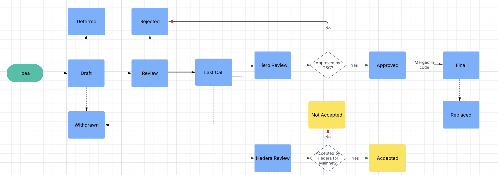
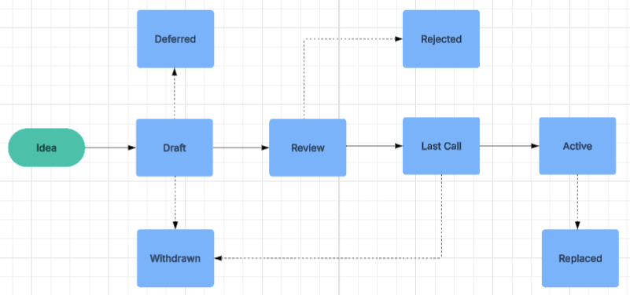

## What is a HIP?

HIP stands for **Hiero Improvement Proposal**. A HIP is intended to provide information or initiate engineering efforts to update functionality under Hiero governance. The HIP should be technically clear and concise, and as granular as possible. Small, targeted HIPs are more likely to reach consensus and result in a reference implementation.

HIPs are intended to be the primary mechanism for proposing new features, for collecting community input, and for documenting the design decisions that go into the Hiero codebase. The HIP author is responsible for building consensus within the community and documenting dissenting opinions.

For HIPs that propose changes to the Hiero codebase (typically Standards Track HIPs for Core, Service, Mirror Node or Block Node categories), the process involves Hiero providing technical approval and Hedera providing review and acceptance if the changes are to be incorporated into the Hedera network or ecosystem.

Because the HIPs are maintained as text files in a versioned repository, their revision history is the historical record of the proposal. HIPs are **not** meant to address *bugs* in implemented code. Bugs should be addressed using issues on the implementation's repository.

> **Note on Hedera Adoption**  
> While the Hiero Technical Steering Committee (TSC) decides on Approving or Rejecting HIPs into the Hiero codebase, there is an optional set of headers (`needs-hedera-review`, `hedera-reviewed-on`, `hedera-acceptance-status`) to note if/when Hedera decides to Accept the HIP to be included on mainnet. If Hedera chooses not to adopt, the `hedera-acceptance-status` can be set to `Not Accepted`. The HIP maintainer is responsible for updating these fields.

## HIP Types

There are three kinds of HIP:

1. **Standards Track**
   Describes a new feature or implementation for the Hiero codebase or an interoperability standard recognized by Hiero. The Standards Track HIP abstract should include which part of the Hiero ecosystem it addresses. Standards Track HIPs require both a specification and a reference implementation.

   - **Core:** Proposals addressing the low-level protocol, algorithm, or networking layers.  
   - **Service:** Proposals that add or improve functionality at the service layer of the Hiero software stack.  
   - **Mirror, Block Node:** Proposals for software designed to retrieve records (transactions, logs, etc.) from the core network and make them available to users in a meaningful way.
   - **Application:** Proposals to standardize ecosystem 
   software that isn’t directly a Hiero node or mirror (e.g., application network software, external contract consensus services, oracles).

2. **Informational**  
   Describes a Hiero design issue or provides general guidelines to the community but does not propose a new feature or standard. Such HIPs do not necessarily represent a community consensus or recommendation.

3. **Process**  
   Describes a process surrounding the Hiero codebase, or proposes a change to one. Process HIPs are similar to Standards Track HIPs but apply outside the code itself. Meta-HIPs are considered Process HIPs.

## HIP Workflow

### Hiero Technical Steering Committee

The Hiero Technical Steering Committee (Hiero TSC) is the body that makes final decisions on whether or not to Approve Standards Track HIPs pertaining to Hiero’s core or service layers. The Committee is also responsible for decisions regarding the technical governance of the open-source codebase donated by Hedera.

### Core Developers

Hiero’s “core developers” include those contributing to the open-source project under the Hiero Organizatioon—employees, contractors, or community members recognized by Hiero.

### HIP Editors

HIP editors are individuals responsible for the administrative and editorial aspects of the HIP workflow, such as assigning HIP numbers and merging pull requests once a HIP is properly formatted.

### Start With an Idea

The HIP process begins with a new idea. It is highly recommended that a single HIP contains a single key proposal or new idea. HIP editors reserve the right to reject a HIP if it appears too unfocused or broad. If in doubt, split your HIP into several well-focused ones.

Each HIP must have a champion (the “author”) who writes the HIP in the specified style, shepherds discussions, and attempts to build consensus. The champion can make a PR of their HIP against the official repository and the PR will serve as the HIP's discussion and the link to the PR will be the value of the `discussions-to` header.

### ⚠️ Setting up DCO

This repository inherits security practices requiring the Developer Certificate of Origin (DCO). Please set up your DCO sign-off before creating or updating a HIP. 

### Submitting a HIP

1. **Fork the HIP repository**, and create a markdown file named `hip-0000-my-feature.md`.  
2. Include the standard HIP front-matter (preamble) at the top, using “Draft” for `status` and “0000” as a placeholder HIP number.  
3. **Open a draft pull request** for your newly created file.  
4. Iterate with the community, updating the PR as needed.  
5. When ready, convert the PR from "Draft" to "Review" to request an editorial review.  
6. The editors will check for correct structure, formatting, and clarity. If the HIP is sound, they will:  
   - Assign a HIP number (usually the PR number)  
   - Merge the PR into the repository with `Draft` status  
7. From there, the community continues discussion—possibly leading to further commits or PRs that update the HIP.

### HIP Review & Resolution

When the HIP author believes the proposal is complete, they may request content review from the core developers and editors. A HIP must be clear and complete, presenting a net positive improvement.

A HIP may be marked **Last Call** to gather final user feedback. 

Following a successful **Last Call** period (or if **Last Call** is deemed unnecessary for minor changes):
- For HIPs requiring Hiero's technical endorsement (most Standards Track and Process HIPs), the Hiero TSC will review the HIP. If they agree, the HIP status changes to **Approved**.
- For HIPs that also require Hedera's acceptance (e.g., changes to be implemented on the Hedera mainnet, typically Standards Track HIPs of type Core, Service, Mirror Node, Block Node where `needs-hedera-review: Yes`), Hedera will conduct a review. If Hedera agrees to adopt and implement the HIP its header property `hedera-acceptance-decision` and `hedera-reviewed-on` should be updated with the date and the decision made (**Accepted** or **Not Accepted**).

A HIP can only be reviewed by Hedera after it has been **Approved** by Hiero TSC (if Hiero TSC approval is required).

### HIP Status Titles

- **Idea** – Pre-draft, not in the repository. 
- **Draft** – The formal starting point of a HIP. The HIP is currently being drafted and is not yet ready for review.
- **Review** – The HIP is ready for review by the community and HIP editors.
- **Last Call** – The HIP is in a final review window, typically 14 days, before being moved to a Hiero TSC approval vote (Service, Core, Mirror or Block Node HIPs) or `Approved` (Application HIPs).
- **Approved** – A Standards Track HIP has been approved by Hiero TSC or by the community in the case of `Application` category HIPs.
- **Final** – A Standards Track HIP has been reviewed and approved by Hiero TSC and its reference implementation has been merged.
- **Active** – A Process or Informational HIP that is currently in effect.
- **Deferred** – A HIP that is not currently being pursued but may be revisited in the future.
- **Withdrawn** – Author has withdrawn the HIP.  
- **Stagnant** – A HIP that has been inactive for a significant period (e.g., 6+ months) may be marked as Stagnant by the HIP editors.
- **Rejected** – The HIP has been rejected by the HIP editors, the community, or a Hiero TSC vote.
- **Replaced** – The HIP has been replaced by a newer HIP.

## HIP Workflow Overview

### Standards Track HIPs

Standards Track HIPs (categories: Core, Service, Mirror or Block Node) follow this general lifecycle:

1.  **Idea**: Propose your idea to the community. Create an [issue](https://github.com/hiero-ledger/hiero-improvement-proposals/issues) to discuss the idea.
2.  **Draft**: Create a copy of the [HIP template](./hip-0000-template.md), fill in the details, and submit it as a pull request (PR) to the HIPs repository. The HIP status should be **Draft**. `needs-hedera-review` and `needs-hiero-approval` should be `Yes`.
3.  **Review**: Once the PR is submitted, the HIP editors and community will review the proposal. The status changes to **Review**.
4.  **Last Call**: If the HIP is generally agreed upon, a HIP editor will assign a `last-call-date-time` and change the status to **Last Call**. This is a final opportunity for community feedback, typically lasting 14 days.
5.  **Approved**: After the Last Call period, if there are no major objections that cannot be resolved, Hiero TSC will vote on the HIP and if it is approved, a HIP editor or maintainer will create a PR changing the status to **Approved**. At this point, the HIP is considered approved by the Hiero community and awaits review by Hedera where needed.
6.  **Final**: When a HIP is implemented in code, the HIP maintainer updates the status of the HIP to **Final** and specifies a `release` number.
7.  **Stagnant / Deferred / Withdrawn / Rejected / Replaced**: A HIP may also end up in one of these states as described in "HIP Statuses".

The possible paths of the status of Standards Track HIPs are as follows:


### Informational, Process and Application HIPs

Informational and Process HIPs follow a simpler lifecycle:

1.  **Idea**: Propose your idea. Create an [issue](https://github.com/hiero-ledger/hiero-improvement-proposals/issues) to discuss.
2.  **Draft**: Create a copy of the [HIP template](./hip-0000-template.md), fill in the details, and submit it as a PR. The HIP status should be `Draft`.
    *   For Process HIPs: `needs-hedera-review` and `needs-hiero-approval` should be `No`.
    *   For Informational and Application HIPs: `needs-hedera-review` and `needs-hiero-approval` should be `No`.
3.  **Review**: The HIP editors and community review the proposal. Status changes to **Review**.
4.  **Last Call**: If generally agreed upon, a HIP editor assigns a `last-call-date-time` and changes status to **Last Call** (typically 14 days).
5.  **Active**: After Last Call, if no major objections, a HIP editor merges the PR into this state.
6.  **Stagnant / Deferred / Withdrawn / Rejected / Replaced**: As described in "HIP Statuses".

The possible paths of the status of Informational, Process and Application HIPs HIPs are as follows:

⚠️ **NOTE**: The diagram below illustrates all valid status transitions:



## What belongs in a successful HIP?

A successful HIP document typically includes:

1. **Preamble**  
   With metadata: HIP number, title, author(s), type, status, discussions link, etc.
2. **Abstract**  
   A short summary (~200 words).  
3. **Motivation**  
   Explains why existing specifications are inadequate.  
4. **Rationale**  
   Explains why particular design decisions were made; includes discussion of alternatives.  
5. **User Stories**  
   "As a (user role), I want (action) so that (benefit)."  
6. **Specification**  
   Technical details and syntax.  
7. **Backwards Compatibility**  
   If incompatible changes are introduced, discuss severity and solutions.  
8. **Security Implications**  
   Address any security concerns explicitly.  
9. **How to Teach This**  
   Guidance on explaining this HIP to others.  
10. **Reference Implementation**  
   Required for Standards Track HIPs to become Final.  
11. **Rejected Ideas**  
   Summaries of alternative ideas and why they were not pursued.  
12. **Open Issues**  
   Items still under discussion.  
13. **References**  
   URLs and other resources used throughout the HIP.  
14. **Copyright/License**  
   HIPs must be placed under the Apache License, Version 2.0.

## HIP Formats and Templates

Use [GitHub-flavored Markdown] with the "HIP Template" as a base. 

### HIP Header Preamble

Each HIP must begin with a YAML front-matter block:
```yaml
---
hip: <HIP number>
title: <HIP Title>
author: <list of authors>
working-group: <optional list of stakeholders>
requested-by: <name(s) or project requesting it>
type: <Standards Track | Informational | Process>
category: <Core | Service | Mirror | Block Node | Application | Process>
status: <Draft | Review | Last Call | Approved | Final | Active | Deferred | Withdrawn | Stagnant | Rejected | Replaced | Accepted [Not to be used, replaced by Approved status]>
last-call-date-time: <optional, set by editor for last call end>
discussions-to: <URL for official discussion thread (usually the link to the original PR of the HIP)>
needs-hiero-approval: <Yes | No>
needs-hedera-review: <Yes | No>
hedera-acceptance-decision: <Accepted | Not Accepted> 
hedera-reviewed-on: <dates in yyyy-mm-dd format>
created: <date in yyyy-mm-dd format>
updated: <dates in yyyy-mm-dd format>
requires: <optional HIP number(s)>
replaces: <optional HIP number(s)>
superseded-by: <optional HIP number(s)>
release: <optional implementation release version>
---
```
Note: Previous status **Accepted** is a legacy status. All **Accepted** HIPs prior to Jan 1, 2025 should be assumend impicitly to have the status **Approved**.

### Reporting HIP Bugs or Updates

Report issues as GitHub issues or pull requests. Major changes to a **Final** HIP typically require either a new HIP or a very careful editorial process.

### Transferring HIP Ownership

If a HIP author no longer wishes to maintain it, they can arrange new ownership. If they cannot be reached, a HIP editor can assign a new champion.

### HIP Editor Responsibilities

Editors handle:

- Approving initial formatting and structural correctness.
- Assigning HIP numbers.
- Merging final changes once the HIP meets requirements.

They do *not* judge the proposals themselves, but ensure the process is followed.

## Style Guide

When referring to a HIP by number, write it as "HIP-X" (e.g. HIP-1). Where possible, link it using relative Markdown links, such as `[HIP-1](./hip-1.md)`.

## History

This document was derived from Bitcoin's BIP-0001, Ethereum's EIP-1, and Python's PEP-0001. Much text was simply copied and adapted.

## Copyright

This document is licensed under the Apache License, Version 2.0. See [LICENSE](../LICENSE) or <https://www.apache.org/licenses/LICENSE-2.0>.
