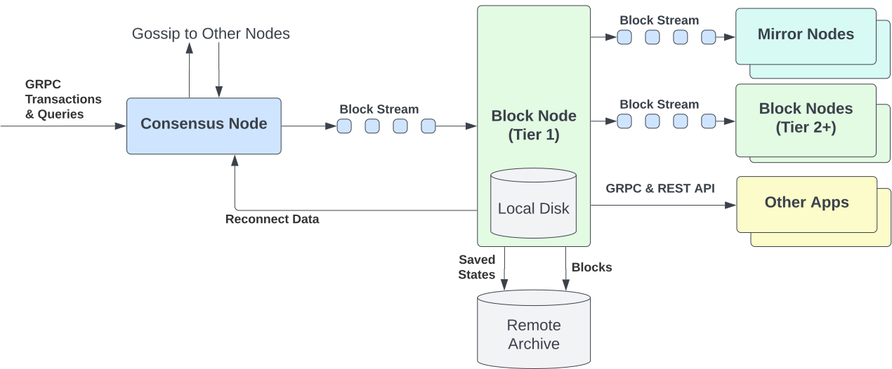
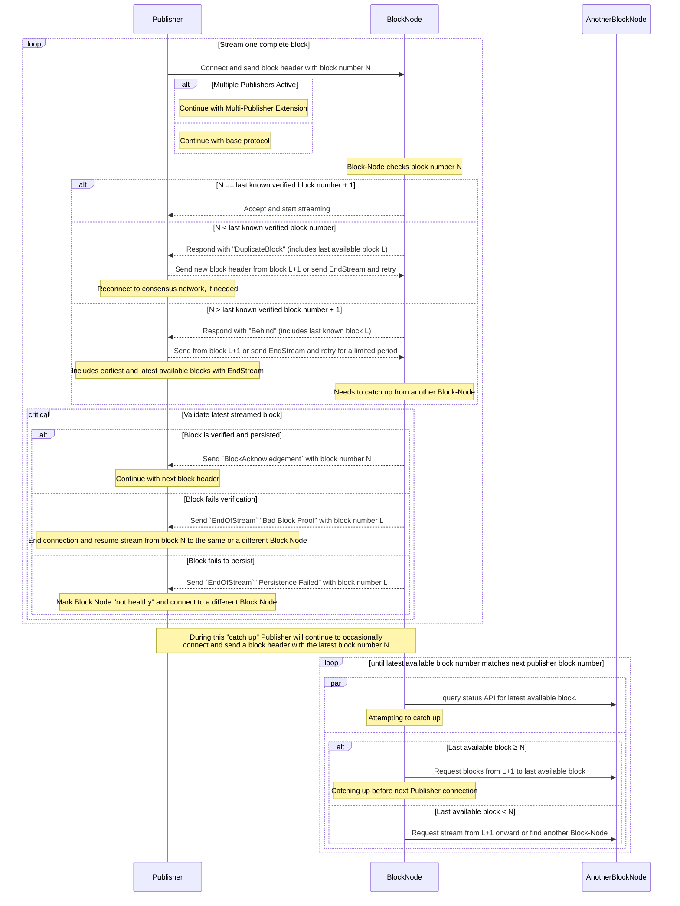
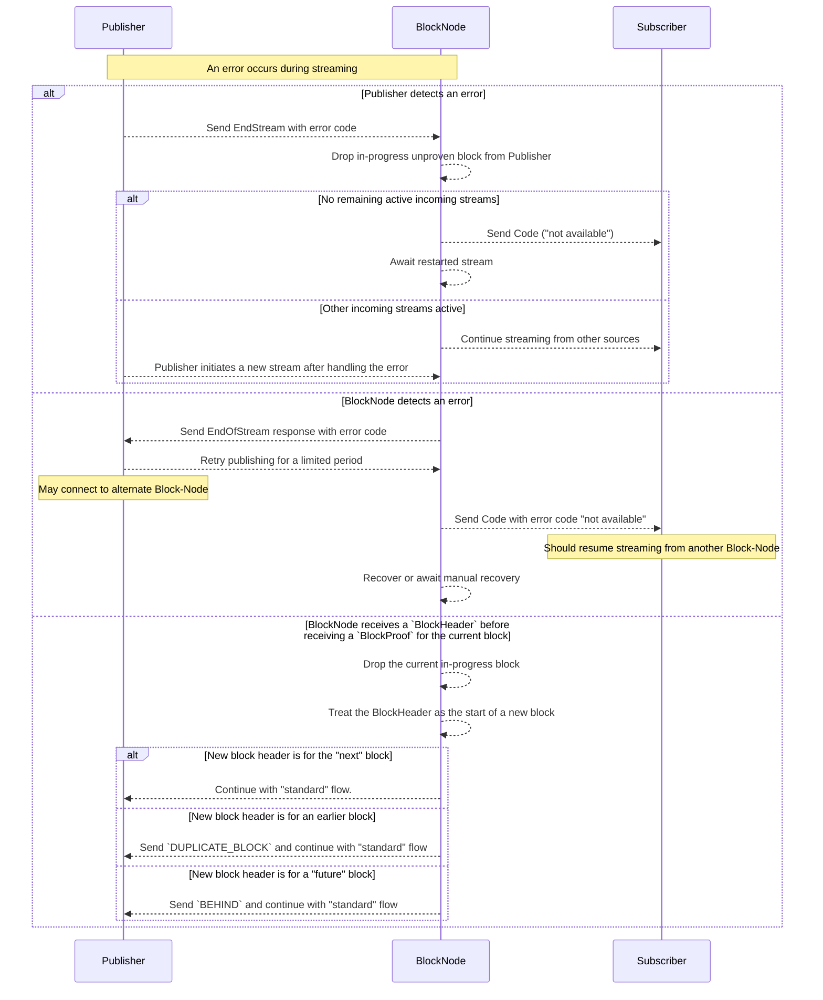

## Abstract

This HIP introduces Block Nodes. Block Nodes receive block streams from Consensus Nodes (or other publishers), verify
each block's integrity, store the block chain, distribute blocks to downstream clients (such as Mirror Nodes and other
Block Nodes), and maintain a copy of consensus network state. Block Nodes also enable critical capabilities including
state proofs, block item proofs, and provide new capabilities for Consensus Nodes such as providing the current state
when bootstrapping a new consensus node or catching up to the current consensus network state when a Consensus Node is
far behind its peers.

By assuming responsibility for long-term block and state storage, Block Nodes will replace the current use of cloud
storage buckets for distributing data to Mirror Nodes and other network data stream consuming clients. Additionally, by
maintaining the latest consensus network state, Block Nodes offload key data management functions from Consensus Nodes,
improving scalability and operational efficiency.
Block Nodes serve as the decentralized data lake for the ledger.

Block Nodes provide robust APIs for filtered or full block streams, random block access, and cryptographic proofs of
block data. This architecture fosters a decentralized data services layer, enabling independent operators to deliver
value-added services such as analytics, aggregation, and real-time data pipelines. This further decentralizes the
ledger and enhances data availability, security, and usability.

Block Node operators are free to innovate on payment for access to these features. They can be commercial and have
connectivity rules / rate limits / SLAs for customers with settlement in native cryptocurrency, Web2 paywalls, or 
provide services at no cost based on their business requirements.



## Motivation

The current Hiero network architecture stores records files, event files, sidecars, state snapshots, and signatures in
S3-compatible cloud storage. Access to this data may be expensive (such as with requestor-pays public cloud storage
buckets). More importantly, the API used for storing and accessing this data is restricted to the standard S3 object
storage API.

While suitable for artifact storage solution, this design limits enhanced capabilities that purpose-built APIs could
provide, such as targeted data schemas, business-inspired performance optimizations, and a streamlined developer
experience that supports end users of downstream services.
By managing transport, parsing and storage, a Block Node can optimize streaming and filtering of block data. Decoupling
data storage from the API enables Block Nodes to provide additional services, such as live state, proof generation and reconnect.

An additional motivation for Block Nodes is to support a more open and inclusive ecosystem, where community members can
run full-featured servers with access to the complete consensus network history and state for verification by
downstream services.

As such, Block Nodes are designed to decentralize data storage and access, enabling independent operators to serve
verified block and state data directly from the consensus network. This allows users and applications to consume the
data without relying on enterprise-operated infrastructure or cloud-specific implementations.

Block Nodes provide a clean architectural separation of responsibilities: Consensus Nodes focus on consensus and
transaction execution, while Block Nodes focus on data availability, accessibility, and verifiability. This paves the
way for a more decentralized and developer-friendly ledger.


## Rationale

The Block Node is introduced to address three strategic goals for the Hiero network: 
1. **Increased data availability**: Ensure that all transaction, event and state data are accessible to network participants for verification.
2. **Greater decentralization**: Increase the number and diversity of data lakes. 
3. **Improved client diversity**: Enable operators and open-source developers across platforms and languages to more easily engage with network data, its distribution and verification. 

In short, these goals reflect a broader effort to reduce reliance on centralized infrastructure, improve access to
consensus network data, and empower a wider range of developers and operators to build on the ledger.

### Communication Protocol

To support these goals, Block Nodes will communicate using **gRPC over HTTP/2**, a protocol chosen for several key
reasons:
- **High-performance streaming**: Enables efficient, low-latency delivery of large volumes of block and state data.
- **Cross-platform compatibility**: Supported across most modern development environments, improving accessibility for
diverse client implementations.
- **Native support for protocol buffers**: Ensures strong typing, forward compatibility, and extensibility of APIs over
time.

This communication model aligns with the protocol stack used by Hiero Consensus Nodes, reinforcing architectural
consistency across the ledger.
While gRPC is the initial focus, the design remains extensible. Future enhancements may include support for WebSocket,
REST, or GraphQL interfaces to meet evolving developer and community needs—striking a balance between performance,
flexibility, and ecosystem adoption.

### Upgradeability

A key design goal of the Block Node is upgradeability and ease of operation across diverse environments, including
different platforms and cloud hosting providers. Unlike Consensus Nodes—which must run identical versions of the node
software to maintain their network integrity—Block Nodes are intentionally decoupled from the consensus layer. This
enables independent deployment and upgrade cycles without requiring coordination with the core Consensus Node network.
Multiple implementations of a Block Node can exist across languages and platforms; as long as they conform to the API specified in this HIP. 
This independence increases the resilience and diversity of the ledger by allowing open-source developers and
operators to maintain Block Nodes on their own cadence and maintenance windows.

While protocol-level consistency must be maintained&mdash;particularly with regard to the block streams protobuf
schema&mdash;Block Nodes are designed with forward compatibility in mind. Even if a node does not fully understand
newly added fields, it should still be able to parse, verify, store, and serve block data reliably, ensuring
consensus network continuity and access to verifiable data during version transitions.
To support transparency and ecosystem interoperability, Block Nodes will expose semantic versioning via API. This
allows clients and developers to identify feature sets, manage compatibility, and ensure predictable integration
behavior across versions.


## User stories

### Personas

- **Hiero Consensus Node Operators**: Enterprise-aligned operators responsible for validating transactions, maintaining
    network consensus, and producing block streams.
- **Independent Block Node Operators**: Independent entities running Block Nodes to support decentralized data access,
    historical state services, or value-added APIs.
- **Mirror Node Operators**: Infrastructure providers consuming verified data from Block Nodes to serve REST API
    endpoints for block explorers dApps and analytics tools.
- **Application Developers / dApp Builders**: Developers building decentralized applications that depend on reliable
    access to historical or real-time block and state data
- **Auditors / Analysts / Researchers**: Users performing independent validation of transactions, querying historical
    state, or analyzing consensus network behavior for compliance or insight


### User Stories

#### Consensus Node Operators

1. As a Consensus Node Operator, I want to publish block streams to one or more Block Nodes, so that I can offload long
    term data storage responsibilities and focus server resources on consensus operations.
2. As a Consensus Node Operator I want to know that the Block Node(s) I send my blocks to are trustworthy so that I can
    trust acknowledgement truly represents secure persistence of a verified block.
3. As a Consensus Node Operator I want to know that I can access a reconnect API with high enough priority and performance to
    effectively recover synchronization with the consensus network.
4. As a Consensus Node Operator I want to implement a shared communication protocol with Block Nodes that defines how
    success or failure  during block stream publishing is communicated back to me in real time. This will allow
    me to implement optimal data distribution algorithms to ensure blocks are persisted amongst a diverse set of Block Nodes.

#### Block Node Operators

1. As a Block Node Operator, I want to provide a `publishBlockStream` API to which one or more Consensus Nodes
   (or other Block Stream producers) can push block streams, so that I can build a complete and reliable record of
    consensus network activity.
2. As a Block Node Operator, I want to verify block proofs as part of block stream ingestion, so that I can ensure the
    authenticity and integrity of the data I store and serve.
3. As a Block Node Operator, I want to persist block data and create state snapshots, so that I can provide historical 
    access and recovery capabilities to other nodes and clients.
4. As a Block Node Operator, I want to serve real-time and historical block streams via a `subscribeBlockStream` API, so 
    that clients can access up-to-date consensus and transactional network activity as it happens and on demand.
5. As a Block Node Operator, I want to provide historical block access via a `getBlock` API, so that users can retrieve
    and analyze past blocks on demand.
6. As a Block Node Operator, I want to offer APIs for querying current and historical state, so that clients can
    understand the evolution of Hiero entities (account, smart contracts, files, tokens, topics and schedules) over time.
7. As a Block Node Operator, I want to offer proof APIs for external validation of blocks and state, so that third
    parties can verify the correctness of consensus network data without relying on trust in my services.
8. As a Block Node Operator, I want to support Reconnect APIs for syncing new or lagging nodes (Consensus or Block), so
    they can catch up to the latest block and state information from the consensus network efficiently and securely.
9. As a Block Node Operator, I want to subscribe to verified block streams from other Block Nodes, so that I can
    increase redundancy, expand coverage, or fill data gaps.
10. As a Block Node Operator, I want to expose a `serverStatus` API to report my current capabilities, so that clients
    can discover my block range, and service availability.
11. As a Block Node Operator, I want to offer filtered block streams to external clients (including Block Nodes and
    Mirror Nodes), so that subscribers only receive the data relevant to their use cases, reducing bandwidth and
    processing overhead.
12. As a Block Node Operator I want to maintain a Block Node that only stores the data within blocks that is important
    to me so that I avoid the cost of storing data within blocks that are not valuable to me.
13. As a Block Node Operator I want to maintain a Block Node that stores only the block ranges that are important to me
    so that I avoid the cost of maintaining blocks that are of no value to me.
14. As a Block Node Operator I want to utilize a storage retention policy that allows me to prune data older than a
    configurable threshold so that I can optimize my storage resources and costs.
15. As a Block Node Operator I want to implement a shared communication protocol with Consensus Nodes that defines how
    success or failure pathways during block stream publication are handled. This will allow me to inform Consensus Nodes
    of the status of their blocks but also implement optimal data ingestion algorithms to ensure blocks are sourced from
    a diverse set of Consensus Nodes.
16. As a Block Node Operator I want to support the cost-effective backup of my data to external archive solutions so
    that I can optimize my local storage resources and costs.
17. As a Block Node Operator I want to deliver state snapshots in a well-defined format that is supported by existing
    tools provided by the Hiero project.
18. As a Block Node Operator, I want to monitor the real-time status of my Block Node system and its block stream,
    including metrics such as consensus node connectivity, block receipt, verification success, and any gaps in block
    history, so that I can quickly confirm proper operation or identify and resolve issues to maintain a complete and
    up-to-date block chain.
19. As a Block Node Operator I want to launch a new Block Node and have that node available to receive new blocks from
    a Consensus Node publisher without the requirement to download all of history first.
20. As a Block Node Operator I want the Block Node to backfill the history of the network over time and in the
    background while still processing the live block stream without interruption or delay.
21. As a Block Node Operator I want to launch a new Block Node with a pre-built archive of all, or nearly all,
    historical blocks to minimize the amount of data my Block Node must download after startup to backfill the full
    history of the network.
22. As a Block Node Operator I want to start the Block Node with an initial bootstrap state snapshot and have the Block
    Node apply state changes from stored blocks in order until it catches up and matches live Consensus Node state.

#### Application Developers / dApp Builders

1. As a dApp Developer, I want to stream real-time transaction data filtered by my application's criteria, so that I
    can monitor and react to relevant on-chain events efficiently.
2. As a dApp Developer, I want to query historical state from a Block Node, so that I can understand application
    behavior over time and debug or audit contract interactions.
3. As a dApp Developer, I want to fetch state proofs for validation in a low-trust model from a Block Node,
    so that I can build applications that do not require trust in centralized infrastructure.

#### Mirror Node Operators
1. As a Mirror Node Operator, I want to consume verified block and state data from a Block Node, so that I can serve
    reliable REST APIs to applications and developers.
2. As a Mirror Node Operator, I want to bootstrap quickly and economically using snapshots and recent blocks, so that I
    can recover from downtime or deploy new infrastructure without full re-sync from stream start.

#### Auditors / Analysts / Researchers
1. As an Auditor or Analyst, I want to retrieve historical block and state data, so that I can conduct investigations,
    perform compliance checks, or reconstruct on-chain activity.
2. As a Researcher, I want to analyze transaction and state trends using structured and verified data, so that I can
    gain insights into network usage, adoption patterns, and protocol behavior.


## Specification

### Terms and Definitions

| Term                              | Definition                                                                 |
| --------------------------------- | -------------------------------------------------------------------------- |
| **Block Node**                    | A software system intended to process a Block Stream and store blocks. The content of a Block Stream is defined in HIP 1056, among others.         |
| **Block Number**                  | A monotonically increasing number assigned by consensus to each block produced by the network.    |
| **Publisher**                     | An entity takes on this _role_ when it publishes blocks to a Block Node via the `publishBlockStream` API. This is typically a Consensus Node.                         |
| **Subscriber**                    | An entity takes on this _role_ when it subscribes to a verified block stream from a Block Node via the `subscribeBlockStream` API.  |
| **Verified Block**                | A verified block is a block for which a Block Proof is received and for which the TSS signature of the network ledger ID is valid.  |
| **Full History Block Node**       | A Block Node that stores block history from network streaming start.  |
| **Archive Block Node**            | A Block Node that archives block history and does not expose consumer API services.  |
| **Partial History Block Node**    | A Block Node that prunes blocks based on a configured period of time or data volume.  |
| **Tier 1 Block Node**             | A Block Node that receives block streams from a Consensus Node.  |
| **Tier 2+ Block Node**            | A Block Node that receives block streams from a Block Node or any non-Consensus Node block stream provider.  |


#### Tier 1 Block Nodes

Tier 1 Block Nodes provide high-availability, performance-critical services directly to Mainnet Consensus Nodes (CNs)
and other Tier 1 Block Nodes. They receive block streams directly from Consensus Nodes and are typically operated by
trusted node operators. For optimal performance, Tier 1 Block Nodes are expected to be deployed in close proximity to
Consensus Nodes, minimizing latency in stream processing and delivery.

#### Tier 2 Block Nodes

Tier 2 Block Nodes extend the capabilities of Tier 1 by offering additional services to developers, applications, and 
the broader community. They receive block streams from Tier 1 nodes or Tier 2 nodes and may offer both free and
monetized data services. These nodes are designed to foster decentralization by allowing independent entities to
operate Block Nodes under flexible models, including subscription-based access, pay-per-query APIs,
or open data access.

#### Archive Block Nodes
Archive Block Nodes are specialized Block Nodes designed for long term storage of the complete history of the blockchain
from the network's streaming start, without exposing consumer-facing API services. They receive block streams from
Consensus Nodes or other Block Nodes, verify the integrity of each block, and archive the data to long term, cold
storage to maintain a permanent, tamper-proof record of all blocks and associated metadata.


#### Partial History Block Nodes
Partial History Block Nodes are Block Nodes that store a dynamic, time-limited portion of the blockchain’s history,
pruning blocks after a configured retention period (e.g., 30 days) or data volume threshold. They receive block streams
from Consensus Nodes or other Block Nodes, verify block integrity, and provide access to recent block data through APIs
for applications, developers, and downstream services like Mirror Nodes. Designed for efficiency, Partial History Block
Nodes balance storage requirements with performance by automatically discarding older blocks, making them ideal for use
cases requiring access to recent transaction and state data.

### Services

Hiero Block Node services will consist of protocol-level support and value adding service-layer innovations.

> Block Node implementers are encouraged to architect services as loosely coupled, independently deployable components,
rather than as tightly integrated or monolithic systems. This modular design promotes lightweight, scalable
deployments—making Block Nodes more accessible to community operators and more flexible for developers seeking to
innovate on top of the data stream.

#### Publish and Subscribe Service separation
Publishing the block stream from the consensus network to the Block Nodes is a critical function that requires
substantial resilience and complexity to ensure the safety of the network and reliability of the block chain.
Subscribing to a stream of blocks from a Block Node is a much simpler and far less sensitive activity as a failed 
subscription can always be resumed at the point where the previous connection ended without adding risk to the system.
It is also very reasonable to have multiple ways to subscribe to a block stream from a Block Node to meet current and
future requirements. Further, most Block Nodes (including substantially all Tier 2 Block Nodes) will not need the
publishing API at all. In order to simplify implementation complexity, provide operational flexibility, and ensure 
severability of these functions, we separate the The Publishing API and the Subscribing API in this HIP. 
The Publishing API meets the complex requirements for resilience, stability, security, and safety needed by the
consensus network and block stream retention, while the Subscribing API remains much simpler and relies on the data
retention in Block Nodes for resilience.

For the purposes of these APIs, the following roles are defined.
* "Publisher" is a role that any software might take on to send blocks to a Block Node, but that this is almost
exclusively intended for consensus nodes.
* "Subscriber" is a role that any software might take on to request a stream of blocks from a block node. All clients
of the Block Node, including other Block Nodes and consensus nodes, may take on the subscriber role when requesting blocks.

#### Block Stream Publish Service

Block Nodes expose a streaming endpoint on the `BlockStreamPublishService` to which a block stream producing
client like a Consensus Node can publish block items. Consensus Nodes or other block stream supplying clients act as
the Publisher feeding the Block Node data.

By Consensus Nodes pushing block stream data to Block Nodes the traffic implications of Block Nodes and other clients
querying a Consensus are avoided. This allows Consensus Nodes to control their data rate and explicitly configure
trusted recipients of its data. As such, a Block Node must be ready and available to accept connections that push the
block stream as blocks are agreed upon by the consensus network.

Block Node operators may optionally configure filters to limit stored content to block items relevant to their use case—for example, filtering by HCS topic. 
Filtering occurs at the block item level, allowing dApps to store only the data they desire.

#### Block Stream Subscribe Service

Block Nodes expose a `BlockStreamSubscribeService` to which block stream consuming clients like a Mirror Node or
dApp can subscribe to stream block items from verified blocks.

This service enables applications, indexers, and data platforms to initiate a pull-based stream of block items directly
from a Block Node to which they can react to consensus network activity as it occurs—without maintaining consensus node infrastructure.

Clients may optionally specify filters to limit streamed content to block items relevant to their use case—for e.g.
filtering by StateChange block items. Filtering occurs at the block item level, allowing dApps to receive only the
data they need. Future enhancements may include more advanced filtering such as transaction level filter (e.g. on
smart contract transactions) or state entity level filtering (e.g. only specific HCS topics).

#### Block Access Service

Block Nodes expose a `BlockAccessService` to which block consuming clients like a Mirror Node or dApp can access historical blocks.

Each block returned by this service is verified, and includes the relevant metadata and signatures necessary for cryptographic validation, ensuring consumers can trust the data without needing direct access to consensus nodes.

#### Block Node Service

Block Nodes expose a `BlockNodeService` to which interested downstream clients like a Mirror Node or dApp can
inquire about details regarding the Block Node.

The `BlockNodeService` provides essential metadata about the operational state and configuration of a Block Node,
enabling clients to make informed decisions about connectivity, compatibility, and data availability.

The service exposes key information such as:
- Current and available block ranges
- Supported API version and protocol capabilities
- Availability of historical state snapshots

This service is especially useful for clients bootstrapping a connection, discovering available features, or selecting
between multiple Block Nodes based on capabilities or data retention. It also helps ecosystem tools—such as indexers,
dashboards, and health check systems—monitor and validate the status of deployed nodes.

#### State Service

Block Nodes expose a `StateService` to which interested downstream clients like a Mirror Node or dApp can query
for Hashgraph state details.

On Hiero mainnets, consensus nodes periodically take state snapshots and store them in centralized cloud
buckets. These backups are primarily used for Consensus Node bootstrapping, disaster recovery, and long-term archival.
However, this data has not been made readily accessible to the broader community, limiting its utility for external
developers and applications.
By maintaining live state and capturing periodic state snapshots, Block Nodes can introduce new state-related services
that provide access to consensus network state at any block height.

> Note: To support state services a Block Node must be provided with a verifiable bootstrap state snapshot at a given
block `N` for the appropriate `LedgerId`. To update state and maintain live state Block Nodes will apply state change
BlockItems in order from blocks `N + 1` onwards. The state snapshot may either be acquired via querying another Block
Node or it may be loaded offline by a block node operator as it is not transmitted as part of the Block Stream.

> Note: In the future a Block Node could offer additional APIs such as on demand Live state, a stream of state changes
or single entity state requests.

#### Proof Service

Block Nodes expose a `ProofService` to which interested downstream clients like a Mirror Node or dApps interested
in verification can request proofs for Blocks, State or data within the Block.

The service exposes cryptographic proofs defined in [HIP-1056](https://hips.hedera.com/hip/hip-1056) and HIP 1200
including but not limited to
- `BlockContentsProof` to verify that a specific `BlockItem` (e.g., a transaction or event) was included in a
    given block.
- `StateProof` to confirm the value of a specific state key at a particular block height.

The ability to request cryptographic state proofs have long been a desired feature for developers and auditors.
However, implementing such functionality directly on consensus nodes would introduce additional computational and
bandwidth overhead, detracting from their primary role of executing transactions and maintaining network consensus.
Moreover, consensus nodes only maintain live state and are not equipped to provide historical state proofs—limiting
their usefulness for applications that require verifiable, point-in-time data.

These proof endpoints empower developers, auditors, and applications to independently verify the integrity of block and state
data—strengthening trust and enabling decentralized verification without needing direct access to consensus
infrastructure and without trusting any single node.

#### Reconnect Service

Block Nodes expose a `ReconnectService` to which clients interested in maintaining live network details can sync
to get the latest blocks and state.

New Consensus Nodes joining the consensus network will utilize `ReconnectService` to bootstrap and synchronize with the
latest state and Hashgraph information so they can begin participating in consensus or data services.
Additionally, it is possible for a consensus node to fall behind due to latency, load, or temporary outages. In this
case the  `ReconnectService` would be used to catch them back.
Block Nodes will also utilize the `ReconnectService` for similar reasons of catching up to latest network activity from
existing full History Block Nodes.

Notably, today, Reconnect is handled by consensus nodes, which temporarily assume a “teacher” role, by sharing recent
Hashgraph data and state snapshots. While effective, this approach imposes additional bandwidth and processing burdens
on consensus node resources that are better dedicated to executing transactions and maintaining consensus integrity.

To support consensus network scalability and improve role specialization, Block Nodes will assume this teacher function.
Block Nodes will act as reliable sources for Consensus Nodes or Block Nodes that need to bootstrap or resynchronize with the 
consensus network, reducing load on consensus infrastructure and improving overall recovery and onboarding performance.


### APIs

The following Block Node Service protobuf API specifications are summaries. The full protobuf specifications
can be found under this HIPs original [protobuf assets](./../assets/hip-1081/protobuf).

> Note: The Block Node utilizes custom gRPC response codes per service to convey explicit expectations of behaviour. 
This was chosen as not all services are required and may be engaged on a Block Node. Additionally, many Block Nodes are
expected to expose unique service APIs. For consistency all gRPC response objects share the same first 4 terminal codes
- `UNKNOWN` (0) ,`SUCCESS` (1), `INVALID_REQUEST` (2) and `INTERNAL_ERROR` (3)

#### Block Stream Publish Service

```protobuf
/**
 * Remote procedure calls (RPCs) for the Block-Node block stream publishing services.
 */
service BlockStreamPublishService {
    /**
     * Publish a stream of blocks. Block Streams publishers connect to this endpoint to push blocks
     */
    rpc publishBlockStream(stream PublishStreamRequest) returns (stream PublishStreamResponse);
}
```

`publishBlockStream` response codes and their details are noted below

| Response code         | Description   |  
| --------------------- | ------------- |  
| `UNKNOWN`             | The server software failed to set a status, and SHALL be considered a software defect. |
| `SUCCESS`             | The Block Node ended the stream in an orderly manner. |  
| `INVALID_REQUEST`     | The client sent a malformed or structurally incorrect request. |  
| `INTERNAL_ERROR`      | The Block Node encountered an error. |
| `TIMEOUT`             | The delay between requests was too long. |  
| `DUPLICATE_BLOCK`     | A block was sent that is already verified and persisted. |  
| `BAD_BLOCK_PROOF`     | A block proof did not verify, the publisher should resend. |  
| `BEHIND`              | The block sent is newer than the Block Node can receive. |
| `PERSISTENCE_FAILED`  | The Block-Node failed to store the block persistently.

> When the publisher is a consensus node it is important to expose error cases that suggest a Block Node is falling
behind or failing to store blocks when expected.

> Notably, a Block Node may consume a block stream from multiple sources e.g. multiple CNs.
This approach can be used to increase the reliability and availability of consensus network data.

> Note: If the publisher is not a Consensus Node a Block Node may receive a filtered block stream via the
`publishBlockStream` endpoint. Filtering support is expanded upon in the Block Stream HIP 1056 and is characterized by
the replacement of block items with hash values while maintaining the ability to carry out block and state proofs on
the block information.


#### Block Stream Subscribe Service

```protobuf
/**
 * Remote procedure calls (RPCs) for the Block Node Stream subscribing services.
 */
service BlockStreamSubscribeService {
    /**
     * Subscribe to a stream of verified blocks published by a Block Node.
     */
    rpc subscribeBlockStream(SubscribeStreamRequest) returns (stream SubscribeStreamResponse);
}
```

If an error occurs during streaming, the Block Node will terminate the stream with a Code response instead of
the next `BlockItemSet`. Clients may choose to retry the stream from the last successfully received block or switch to
a different Block Node for continued access.

`subscribeBlockStream` response codes and their details are noted below

| Response code                 | Description   |
| ----------------------------- | ------------- |
| `UNKNOWN`                     | The server software failed to set a status and SHALL be considered a software defect. |
| `SUCCESS`                     | The request succeeded. |
| `INVALID_REQUEST`             | The client sent a malformed or structurally incorrect request. |  
| `INTERNAL_ERROR`              | The Block Node encountered an error. |
| `INVALID_START_BLOCK_NUMBER`  | The requested start block number is not valid. |
| `INVALID_END_BLOCK_NUMBER`    | The requested end block number is not valid, such as when the end is less than the start block number |
| `NOT_AVAILABLE`               | The requested stream is not available. |


#### Block Node Service

```protobuf
/**
 * Remote procedure calls (RPCs) for the Block Node Ancillary services.
 */
service BlockNodeService {
    /**
     * Read the status of this Block Node server.
     */
    rpc serverStatus(ServerStatusRequest) returns (ServerStatusResponse);
}
```

> In the future a Block Node could expose which value-added services are enabled (e.g., filtering, proofs, streaming modes)

#### Block Access Service

```protobuf
/**
 * Remote procedure calls (RPCs) for the Block Node block services.
 */
service BlockAccessService {
    /**
     * Retrieve a single verified block from the Block Node.
     */
    rpc getBlock(BlockRequest) returns (BlockResponse);
}
```

`getBlock` response codes and their details are noted below

| Response code     | Description   |
| ----------------- | ------------- |
| `UNKNOWN`         | The server software failed to set a status,and SHALL be considered a software defect. |
| `SUCCESS`         | The request succeeded. |
| `INVALID_REQUEST` | The client sent a malformed or structurally incorrect request. |  
| `INTERNAL_ERROR`  | The Block Node encountered an error. |
| `NOT_FOUND`       | The requested block was not found as it does not exist. |
| `NOT_AVAILABLE`   | The requested block is not currently available on this Block Node server. |


#### State Service

```protobuf
/**
 * Remote procedure calls (RPCs) for the Block Node State snapshot
 * and query services.
 */
service StateService {
    /**
     * Read a state snapshot from the Block Node.
     */
    rpc stateSnapshot(StateSnapshotRequest) returns (StateSnapshotResponse);
}
```

`stateSnapshot` response codes and their details are noted below

| Response code     | Description   |
| ----------------- | ------------- |
| `UNKNOWN`         | The server software failed to set a status,and SHALL be considered a software defect. |
| `SUCCESS`         | The request succeeded. |
| `INVALID_REQUEST` | The client sent a malformed or structurally incorrect request. |  
| `INTERNAL_ERROR`  | The Block Node encountered an error. |
| `NOT_AVAILABLE`   | The state snapshot proof is not available for the specified block. |


#### Proof Service

```protobuf
/**
 * Remote procedure calls (RPCs) for the Block Node block contents proof
 * and state proof query services.
 */
service ProofService {
    /**
     * Request a block contents proof for a given block from the Block Node.
     */
    rpc getBlockContentsProof(BlockContentsProofRequest) returns (BlockContentsProofResponse);

    /**
     * Request a state proof for a given state item and block from the Block Node.
     */
    rpc getStateProof(StateProofRequest) returns (StateProofResponse);
}
```

`getBlockContentsProof` response codes and their details are noted below

| Response code                 | Description   |
| ----------------------------- | ------------- |
| `UNKNOWN`                     | The response code is unspecified. |
| `SUCCESS`                     | The state proof was successfully retrieved. |
| `INVALID_REQUEST`             | The client sent a malformed or structurally incorrect request. |  
| `INTERNAL_ERROR`              | The Block Node encountered an error. |
| `ITEM_NOT_FOUND`              | The specified block item was not found. |
| `NOT_AVAILABLE`               | The block contents proof is not available for the specified block. |
| `DUPLICATE_HASH_ITEM_FOUND`   | Duplicate hash items were found, causing ambiguity. |


`getStateProof` response codes and their details are noted below

| Response code     | Description   |
| ----------------- | ------------- |
| `UNKNOWN`         | The response code is unspecified. |
| `SUCCESS`         | The state proof was successfully retrieved. |
| `INVALID_REQUEST` | The client sent a malformed or structurally incorrect request. |  
| `INTERNAL_ERROR`  | The Block Node encountered an error. |
| `KEY_NOT_FOUND`   | The specified state key was not found. |
| `NOT_AVAILABLE`   | The state proof is not available for the specified block. |


#### Protobuf Schema Management

Block Nodes are responsible for streaming and parsing Block Stream messages encoded in Protocol Buffers (protobuf), as
defined in the [hiero-consensus-node](https://github.com/hiero-ledger/hiero-consensus-node) repository. While protobuf
offers a structured and extensible format for communication, there are specific scenarios that require careful handling
by the Block Node to ensure stream integrity and resilience:

1. Protobuf Version Upgrades:
Protocol Buffers are designed with built-in forward and backward compatibility. As a result, versioning the block
stream schema is generally unnecessary. Block Nodes must be capable of processing older and newer message formats
gracefully, ignoring unknown fields while continuing to verify and store the stream contents reliably.

2. Stream Pauses Due to Consensus Node (CN) Upgrades:
Consensus nodes periodically undergo coordinated software upgrades, during which data streams may temporarily pause.
Block Nodes should anticipate an end-of-stream signal during these events and handle the interruption gracefully
without impacting downstream services.

3. Missing Block Proofs:
Each block in the stream—excluding certain record file block items—is typically terminated with a block proof,
providing cryptographic assurance that the block was verified by the consensus network. If a block proof is absent for an
extended period, this may indicate that the CN has fallen behind, is unable to compute the proof, or is encountering
an ISS (Inconsistent State Signature). In such cases, the Block Node should not immediately terminate the connection,
rather it will only terminate when a clear case described by the protocol is encountered. In the case of a connection
termination Subscriber connections actively receiving block items may be closed after a configurable timeout. To aid
debugging of the stream disruption Block Nodes could persist partial data (e.g., current and previous block contents).

4. Delayed Block Proofs and Cascade Proofs:
In some cases, a delayed block proof may arrive indirectly through a cascade proof, where the block proof signature is
from a later block that retroactively verifies the block through a chain of prior block hashes. Block Nodes must be
capable of recognizing and validating such proofs to maintain a complete and verifiable block history.
It is important to be clear that a given consensus node will not send a block header for block N+1 until the
block proof for N is sent; this is invariant. A delayed proof delays all subsequent blocks as well.
Further, the block proof for block N+1 does not prove block N; it is only the signatures gathered by consensus for
Block N+1 that are used to build the block proof for block N (and that block proof is still sent for block N, not N+1).

```mermaid
gantt  
    title "Cascade Proof" timing diagram  
    %% We just need order, not days, so (mis)use milliseconds for the times  
    dateFormat SSS  
    axisFormat %L  
    tickInterval 5millisecond  
    section Consensus Node  
      Block 9 Produced :active, 002, 012  
      Block 9 Send :active, 004, 028  
      Block 9 Gather Signatures (fail) :done, 012, 016  
      Block 10 Produced :active, 012, 022  
      Block 10 Gather Signatures :done, 022, 026  
      Block 9 Craft Cascade Proof :done, 026, 027  
      Block 9 Send Proof :active, 027, 028  
      Block 10 Craft Proof :done, 027, 029  
      Block 10 Send :active, 028, 032  
      Block 10 Send Proof :active, 032, 034  
     section BlockNode  
      Block 9 Receive :active, 002, 028  
      Block 9 Verify :active, 028, 029  
      Block 9 Acknowledge :milestone, 030, 030  
      Block 10 Receive :active, 028, 032  
      Block 10 Verify :active, 032, 033  
      Block 10 Acknowledge :milestone, 033, 033 
```




### Communication Protocol

A protocol for communication is required to facilitate predictable and secure communication between nodes and clients.

#### publishBlockStream Communication Protocol

A summarized handshake of communication between a publisher and a BN is as follows
- A publisher will send a batch of items starting with a `BlockHeader` on connection
- A Block Node will accept the stream if it is the next block or the Block Node has no cache of previous blocks. 
    - If the block is less than the last known verified and persisted block, the Block Node will respond with a
        `DuplicateBlock` response including details of the last known block. 
    - If the block is greater than the last known verified and persisted block, the Block Node will respond with a
        `Behind` response including details of the last known block. A publisher must send either an earlier block or
        an `EndStream` in response. If an `EndStream` is sent by the publisher it must include its earliest known block
        to signal to the Block Node how large of a catch-up range it must resolve. In this case the Block Node may
        implement a backfill path from another Block Node to resolve gaps in blocks, where applicable.
- Upon receipt of a `BlockProof` item, a Block Node will  verify and persist the given block. Once complete the Block
    Node will send an a `BlockAcknowledgment` with the block number to inform a CN that its transmitted block has been
    received, verified and persisted.
- During block item streaming, errors may occur from either side.
    - If a Publisher detects an error it must send an `EndStream` response instead of the next `BlockItem`. A Block Node
        will drop incomplete blocks from that Publisher.
    - If a Block Node detects an error it will send an `EndOfStream` response to all publishers specifying the latest
        verified and persisted block. A publisher may start a new stream and resume after the indicated block. In the
        case of repeated errors, the publishers may end its connection and publish its blocks to another Block Node.

> Note: The last known block is the most recent block a Block Node has verified and stored locally. For Tier 1 Block
> Nodes, this number only increases with network progression and local block ingestion. For Tier 2 Block Nodes, this
> number may vary if operators adjust the local block storage based on their capacity to maintain the full history.

In particular a protocol for communication between Consensus Node publishers and Block Nodes is essential to ensure the
reliable and efficient processing of consensus output.
The following illustration highlights the communication between the producer Consensus Node and a Block Node




The following illustration highlights the impacts of the communication protocol on a Subscriber to a Block Node as a result of responses code between the producer Consensus Node and a Block Node



#### subscribeBlockStream Communication Protocol

An overview of communication between a Block Node and a subscriber is as follows:
1. A client initiates a subscription request, specifying:
    - A block start (required).
    - A block end (required, may be `uint64_max` to indicate "forever").
2. The Block Node validates the request:
    - If the requested start block is earlier than available data, it responds with `NOT_AVAILABLE`.
    - If the end block is set to `uint64_max`, the stream is treated as open-ended, continuing until:
        - The client disconnects,
        - The Block Node enforces a streaming limit,
        - A network communication error occurs, or
        - The Block Node restarts.

This protocol captures the communication between a Block Node and a Mirror Node Nodes subscriber.

## Backwards Compatibility

Block Nodes propose to completely replace the existing cloud storage buckets and replace the record file format with
the block stream format.
All consumers of record stream data from the existing cloud storage buckets will need to change the mechanism of
access, change the mechanism of payment, and adjust any processing logic to process block stream data.

With consideration for Hiero transaction protobuf type formats - the Block Node will support the new Block Stream
format, which incorporates the existing transactional API formats by reference.

## Security Implications

Block Nodes do not sign or co-sign transactions, nor do they participate in consensus. They do not hold custody of user
assets and therefore are not custodial in nature.

To support authentication and monetization, each Block Node must possess at least one account on the Hiero network. This
account enables identification by consensus nodes—particularly when block items are streamed directly—and facilitates
the receipt of payments for services. Operators may optionally use multiple accounts to separate concerns such as
authentication, metering, and billing.

In applicable configurations, Block Nodes will acknowledge receipt and verification of blocks back to the stream
publisher (whether a Consensus Node or another Block Node). This feedback mechanism allows the publisher to track
successful delivery and optionally implement back-pressure or rate control.

A Block Node may receive a block stream directly from a Consensus Node or indirectly from another Block Node. Because
each block in the stream includes verifiable cryptographic proofs, the source of the stream does not affect data
integrity—only latency, trust assumptions for availability, and potentially the service fees involved.

A publisher may also explore additional network protocols in their deployment architecture to increase trust and
reliability of the target of their stream. Examples of this include TLS to provide additional authentication,
encryption and data integrity checks for the block streams data being transmitted. Similarly Block Node operators may
consider additional network protections such as rate limiting in their deployment depending on business justification.

Block Nodes may also implement targeted metrics that observe the nature and latency of blocks received from Consensus
Nodes and provide actionable details to operators.

## How to Teach This

To effectively educate and inform users about Block Node operation, comprehensive technical documentation, blogs, and
webinars will be essential. Technical documentation will provide detailed and in-depth explanations of operation modes,
usage, and best practices, ensuring that developers and mirror node operators can fully understand and transition to
block stream consumption from a Block Node as well as Block Node hosting.

Blogs will offer more accessible and engaging content, highlighting use cases, real-world applications, and the benefits
of a Block Node, catering to a broader audience of Hiero stakeholders. Webinars will serve as interactive platforms
for live demonstrations, Q&A sessions, and expert insights, enabling participants to gain a deeper understanding through
direct engagement with subject matter experts.

## Reference Implementation


## Rejected Ideas

### BN to CN staking as a requirement for a CN before streaming to a BN.
It was suggested that to help incentivize long term Block Nodes that a BN would stake some minimum amount of HBAR to a
CN. In which upon reward of the full staking period a BN would recuperate staking rewards but also additional reward
for offering DA

### BN to CN staking as a mechanism to ensure long term Date Availability (DA)
It was suggested that to help incentivize long term Block Nodes that staked and consumed a stream for at least the
staking period would receive an additional reward for offering DA

### App to BN allowances to pay for API usage
It was suggested that one mechanism of paying in advance would be for a client such as a BN or MN or app to first offer
a BN an allowance of some amount of HBAR. The BN would then periodically debit from the allowance to pay itself after
responding to a clients calls. The issue was there was a fear that the client to rescind the allowance after time and a
BN would be 1 or 2 blocks in time off of the accurate allowances which could result in services offered for free if the
client was being malicious.
Additionally, there were possible write-amplification concerns where a poorly implemented debit process could create
significant additional transactions every block, resulting in a large number of unnecessary transfers.

### BlockItem Service
Returning a single request BlockItem seemed to not be a valuable service out of the gate. 
Especially without the ability to cleanly identify an item it doesn’t seem worthwhile for a BN to return a BlockItem vs
a Block.

### Periodic CN provided state snap shots
With record streams the CN creates a state snapshot every 15 mins. A question was asked if this should be exposed to
allow BNs to start up or compare state periodically. However, this would add additional low usage process on the CN.
It would also defeat the goal of removing the bandwidth, processing, and complexity of managing state snapshot
transfers from the CN.
Block Nodes that manage live state or produce state snapshots require a state snapshot to start up if not active since
genesis for that network. That snapshot should, however, be transferred manually (either from cloud storage or another
Block Node).
The consensus node will continue to maintain state snapshot for local backup only and will be short-lived ephemeral
data (if stored at all).
A running Block Node that requires a state snapshot for some reason should retrieve it from another Block Node.

### Gossiping Block Node
Initially there was a desire for a Block Node network that communicated via gossip to increase the ease of transmission
and decentralized nature of block nodes in terms of discoverability. This has benefits as it also reduces the reliance
on reconnect and backfill via the gRPC APIs. This remains a consideration of Block Nodes, however, the complexity of
the required protocol, the consideration of applicable open source standards and the questions of "What data should be
included in gossip?" warrant a more purposeful consideration in future. As such it was agreed to push gossip discussions
to a future HIP.

## Open Issues/Ideas/Tasks
- [ ] Flesh out Proof Service response components, Noting additional proof types
    - Block Proof
    - HinTS Proof
- [ ] Expand Reconnect Service
    - Speak to the need and value of BN provided reconnect vs CN
    - Highlight BN -> BN reconnect
    - Note details of what reconnect will provide i.e. latest state + x
- [ ] Flesh out Single entity state query e.g. return account `0.0.x` 

## References

- [HIP 1056: Block Streams](https://hips.hedera.com/hip/hip-1056)
- [HIP 1137: Block Node Discoverability](https://github.com/hiero-ledger/hiero-improvement-proposals/pull/1137)
- [HIP 1183: The hinTS threshold signature scheme](https://github.com/hiero-ledger/hiero-improvement-proposals/pull/1200)
- [HIP 1193: Records to block streams cutover](https://github.com/hiero-ledger/hiero-improvement-proposals/pull/1193)

## Copyright/license

This document is licensed under the Apache License, Version 2.0 -- see [LICENSE](../LICENSE) or
(https://www.apache.org/licenses/LICENSE-2.0)
