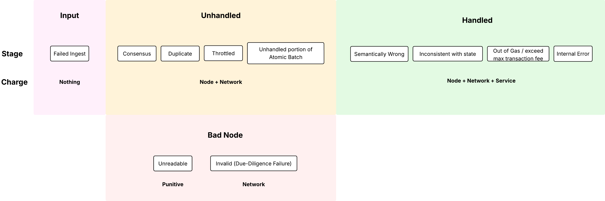

# Abstract

This proposal introduces a simplified and transparent fee model for Hiero networks. It reduces code complexity, enhances
network performance, and improves predictability for fee calculations. Tools like SDKs and the Mirror Node Explorer can
accurately estimate fees using the same logic as consensus nodes. The method for converting USD fees to HBAR remains
unchanged.

# Motivation

The current fee schedule configuration and implementation is complex, leading to bugs and inconsistencies. In contrast,
this HIP makes understanding fees as easy as ordering a pizza: a base fee plus extras. It makes costs clear and
consistent.

# Rationale

A transaction will have a `base` plus `extras` for each additional feature. Fees are split into three components:

- Node fee: Paid to the submitting node, based on bytes and signatures. Encourages nodes to accept transactions.
- Network fee: Covers gossip, consensus, signature verifications, fee payment, and blockchain storage.
- Service fee: Covers execution costs, state saved in the Merkle tree, and additional costs to the blockchain storage.

Configuring the fee schedule is the responsibility of the deploying network (e.g. Hedera) to set. Since fee schedules
must be deterministic across nodes, this HIP simply defines the breakdown of base fee and extras for each transaction
type and how to calculate the `node`, `network`, and `service` components of the fee. If new transactions are added in
the future, their specification will include their fee structure.

In addition during operation some transactions will pass and some will fail. All transactions are priced consistently regardless of the type of
transaction, and if they pass or fail.

# User Stories

1. **Developer / End User**
    1. **As an application developer**, I want a clear and concise breakdown of all fees charged for my transactions and
       queries, so I can understand how my code impacts fees and optimize accordingly.
    2. **As a Hiero developer**, I want to test and verify the fee logic in my implementation, so I can ensure it
       charges users correctly across all transaction types.
    3. **As an HBAR holder who has staked to a node**, I want to confirm that my share of staking rewards—funded by
       transaction fees—is correctly calculated and distributed, so I can trust the network’s economic model.
2. **Auditor / Compliance**
    1. **As an auditor**, I want to independently verify that fees charged by the network align with the published fee
       schedule, so I can ensure transparency and compliance.
3. **Network Governance**
    1. **As a Hiero network governing authority** (e.g., Hedera Council), I want to validate that the network applies
       fees correctly across all services, so I can maintain trust and fairness in the ecosystem.
    2. **As a Hiero network governing authority** I want to create a Hiero network that does not have any fees (i.e. free).
4. **Node Operators**
    1. **As a block node or mirror node operator**, I want to offer value-added services that provide visibility into
       the fees charged to user accounts, so I can help users understand and audit their fee-related activity.
    2. **As a node operator**, I want assurance that the node's portion of collected fees is accurately deposited to my
       node account, so I can monitor revenue and maintain operations.

# Glossary
**Base Fee:** The fixed minimum fee (in tinycents) charged for a transaction or query before adding any extras.

**Extras:** Additional cost factors that are applied on top of the base fee, such as signatures, bytes, keys, gas, or token types. Each extra has a name, unit fee, and optional included count.

**Node Fee:** The portion of a transaction fee paid to the submitting node. It compensates the node for pre-checking the transaction and incentivizes nodes to accept transactions from users. Calculated based on bytes and signatures.

**Network Fee:** The portion of a transaction fee that covers gossip, consensus, signature verification, fee payment, and blockchain storage. Typically combined with the service fee into the Fee Collection Account.

**Service Fee:** The portion of a transaction fee that covers execution costs, state persistence in the Merkle tree, and additional storage or runtime expenses.

**Tinycent:** The smallest unit of fee measurement in this model. One cent USD = 10^8 tinycents. One dollar USD = 10^10 tinycents. Using tinycents avoids floating-point calculations.

**Unreadable Transaction:** A transaction whose bytes cannot be parsed as a valid protobuf `Transaction`. Such transactions are not stored in state, and the submitting node is penalized with a punitive unreadable fee.

**Invalid Transaction:** A transaction that fails due diligence checks by the submitting node (e.g., payer cannot afford the fee, incompatible fields, exceeding throttles). For invalid transactions, only a minimal network fee is charged to the node, not the payer.

**Unhandled Transaction:** A transaction that is well-formed and passes due diligence but is not executed, often due to throttling, atomic batch failures, or duplication. The payer is still charged a node fee and standard network fee.

**Bad Transaction:** A transaction that passes due diligence but fails during execution (e.g., out of gas, semantically invalid, inconsistent with state, or triggers `FAIL_INVALID`). Full node, network, and service fees are charged to protect the network.

**Atomic Batch Transaction:** A grouping of multiple transactions submitted together. Some may succeed, some may fail, and others may remain unexecuted; each outcome determines how fees are applied.

**Congestion Pricing:** A dynamic fee adjustment mechanism triggered when a specific throttle (e.g., transactions per second) reaches a critical sustained level. Used to protect the network under high load.

**Block Stream:** The record of transactions emitted by consensus nodes. It includes transaction hashes, metadata, and outcomes, but not necessarily the full transaction bytes (e.g., for unreadable transactions).

**Fee Schedule:** The configuration file defining base fees, extras, node fee rules, network multiplier, and service fees for all transactions and queries. Stored in system file `0.0.113`.

**Included Count:** The number of un:its of an extra that are included in the base fee before additional charges apply.

# Specification

Fees protect the network and incentivize behavior. Each transaction's fee has node, network, and service components.

The *node* fee component describes the fee to be paid to the node that submitted the transaction to the network. This
fee exists to compensate the node for the work it performed to pre-check the transaction before submitting it, and
incentivizes the node to open ports to the world to accept new transactions from users. This fee is calculated in a
consistent manner for *all* transactions. It is always based on the size of the transaction (in bytes) and the number of
signatures. Every node has a specific number of bytes it can gossip to other nodes per second. From the perspective of
the node, every transaction offers fair reward, so there is no incentive to prefer one transaction over another.

The *network* fee component covers the cost of gossip, consensus, signature verifications, fee payment, and blockchain
storage (persisting state). This component is typically combined with the *service* fee to determine the total fee paid into the network’s
Fee Collection Account (see [HIP-1259](https://hips.hedera.com/hip/hip-1259)).

The *service* fee component covers the remaining cost of execution (handling the transaction) and populating the
blockstream with any additional details. This fee depends on the inherent properties of the transaction, and sometimes
the network state (e.g., auto-account creation).



Normally a transaction fee will be made up of node, network, and service components added together. But this is not true
for all transactions.

### Unreadable Transactions

If a transaction cannot be parsed, then the node that included that transaction in their event will be charged for
sending unparsable bytes. Honest nodes will never send unreadable bytes. A node sending unreadable bytes may be attempting to
attack other nodes. Unreadable transactions *are not stored in state*, and the *hash* of the transaction will be stored
in the blockstream and not the data. See
the [Block Stream HIP-1056](https://github.com/hiero-ledger/hiero-improvement-proposals/blob/a589eabde3099ca2de384c0f2408ffe8f2fa6ba4/HIP/hip-1056.md)
for details.

The amount a node will be charged for unreadable transactions is defined in the Fee Schedule, and is usually set to a
punitive fee, and should *at least* be large enough to cover the cost of the maximum number of bad bytes they sent. The
total possible number of bytes is already limited on a consensus node by the maximum network-configured limits (outside
the scope of this HIP).

Unreadable transactions simply have an *unreadable fee*, there is no *node fee* component, since a bad node should not
earn a reward for sending unreadable bytes!

### Invalid Transactions

When a node is given a transaction from a user, it checks to make sure the payer can pay for that transaction. The node
also verifies other properties of the transaction, such as verifying the transaction doesn’t use an incompatible set of
fields, or specify two different transaction bodies, or by submitting more transactions than they should have based on
the throttles, or other such problems. For all cases where a due-diligence failure has occurred, the node itself is
charged (and not the payer). For an invalid transaction, only the *network fee* is charged, since the transaction is
otherwise unhandled (no *service* component) and the node should not be rewarded for sending an invalid transaction (no
*node* component).

### Unhandled Transactions

If a transaction has been received, can be parsed, and didn’t fail due-diligence checks, but is not handled, then the
payer will be charged a *node fee* and a standard *network fee* to cover the cost of gossip, signature verification, fee
charging, and inclusion in the blockchain. Examples of cases where the transaction is not handled include:

1. **Throttled Transactions**. When a node is given a transaction from a user at ingest, the node checks whether the
   throttle conditions are met for that transaction before submitting it to the network. But a malicious node may ignore
   throttles and send too much data to the network (this would count as a due-diligence failure, see above). Or
   sometimes, such as with smart contracts, throttling must happen during the *handle transaction* phase, and in this
   case, the payer must pay for part of the transaction cost, even though the transaction wasn’t handled.
2. **Atomic Batch Transactions**. In an Atomic Batch Transaction, it is possible that some of the transactions succeed,
   and others fail, and others are not executed at all. For example, an Atomic Batch Transaction may have 4
   transactions. The first two succeed, but the third fails, and the fourth is not executed at all. In this case, the
   user will be charged the full cost of the first three transactions, but only the “unhandled transaction” cost for the
   remaining one.
3. **Duplicate Transactions**. Sometimes a user may wish to submit the same transaction to multiple nodes, possibly to
   reduce the risk of a faulty node failing to submit its transaction to consensus in a timely manner. If two nodes both
   receive the same transaction and neither has yet seen this transaction before, then both will submit this transaction
   to the network. When handling transactions, we only charge the normal fee for the first such transaction. All the
   remainder are *unhandled* transactions and charged accordingly.

In all such cases, it is imperative that we determine the correct fee to charge. This fee will be based on the number of
signatures, the number of bytes, and some base fee that covers basic handling costs and inclusion in the blockstream.

### Bad Transactions

If the transaction passes due-diligence, but otherwise fails during handling, then it is charged full freight — *node*,
*network*, and *service* fee components. Examples:

1. **Semantically Wrong**. For example, the transfer list in a `CryptoTransfer` transaction must balance to zero.
2. **Inconsistent with State**. A transaction may be inconsistent with the state (e.g. a `MessageSubmit` transaction
   isn’t signed by the `SubmitKey` but one is specified, or the destination account in a crypto transfer has
   `receiverSigRequired` but no such signature is present).
3. **Out of Gas**. The transaction may have a `transactionFee` (the maximum amount the payer is willing to pay for that
   transaction), or it may have a gas limit (for smart contracts), and the transaction may end up costing more than
   these specified maximums, leading to those maximums being charged.
4. **Buggy Transactions**. The `FAIL_INVALID` response code indicates that a transaction failed due to a bug in the
   consensus node software. Such failures must be charged to the payer, otherwise if an attacker find a specific set of
   criteria to deterministically trigger `FAIL_INVALID`, they could launch a denial of service attack.

Bad transactions must charge the full cost to protect the network by charging for work done, whether the transaction
completed successfully or not.

### Congestion

If throughput or entity congestion is enabled on a Hiero network if the TPS for a specific throttle reaches a critical sustained level, then *congestion pricing* can take effect.

## Configuration

Fees are configured using a JSON file and stored in a new system file `0.0.113` on the network. The existing fee schedule 
file `0.0.111` will remain in the legacy format to not break existing consumers, but it will not see any further
updates. All fees are defined in USD, as *tinycents*. 10^8 *tinycents* form a cent in USD. 10^10 tinycents are one dollar
USD. By using tinycents, we provide a high degree of precision in pricing while avoiding floating point math which is
imprecise for financial calculations.

_Unit reference:_ 1 cent = 10^8 tinycents; 1 USD = 100 cents = 10^10 tinycents.

> [!NOTE]
> Throughout this document prices for fees are included. These prices are for **descriptive purposes only**. The
> actual values in a valid config are the responsibility of the network owners, such as the Hedera Council for the
> Hedera network. No prices in this HIP are considered authoritative.

The configuration file is a JSON document in Protobuf-JSON format. The file defines:

1. **Extras**: The set of extra charges which may be used for any *node*, *network*, or *service* fee.
2. **Node**: The configuration for computing the node fee; applicable to all transactions
3. **Network**: The configuration for computing the network fee; applicable to all transactions
4. **Services**: The set of service fee calculations for all transactions and queries, grouped by gRPC service.
5. **Unreadable**: Used when transaction bytes are not valid Protobuf.

For each *node*, *network*, and *service* fee, there is a `baseFee` which is the fixed price in USD, along with zero or
more `extras` defining additional features and their associated costs. All extras are defined once within the file, and
referenced from different transactions and queries.

The basic structure of this JSON follow can be seen below:

```json
{
  "version":0,
  "extras": [ ... ],
  "node": { ... },
  "network": { ... },
  "services": [ ... ],
  "unreadable": { ... }
}
```

### Extras

Extras are fees *in addition to* the `baseFee`. They are defined once in the configuration, and referenced by name
throughout the document. The fee **must** be defined. When computing fees, we simply tally up the number of extras, and
add the tally to the `baseFee` to determine the fee component.

```json
{
  "extras": [
    {
      "name": "Signatures",
      "fee": 100000
    },
    {
      "name": "Bytes",
      "fee": 10000
    },
    {
      "name": "Keys",
      "fee": 10000000
    },
    ...
  ]
}
```

The following table lists each extra, its name, and the description.
| Extra                      | Description                                                                                                                                                                                                                      |
| -------------------------- | -------------------------------------------------------------------------------------------------------------------------------------------------------------------------------------------------------------------------------- |
| Signatures                 | Number of signatures on the transaction (at most one verification per signature).                                                                                                                                                |
| Bytes                      | Size of the transaction in protobuf bytes.                                                                                                                                                                                       |
| Keys                       | The number of keys being defined on this transaction. For example, when creating an account, this is the number of keys on the account. A threshold key with 10 keys counts as 10 keys. Nested key structures count up all keys. |
| TokenTypes                 | Number of token types referenced.                                                                                                                                                                                                |
| NFTSerials                 | Number of distinct NFT serials.                                                                                                                                                                                                  |
| Accounts                   | Number of accounts loaded to handle the transaction.                                                                                                                                                                             |
| StandardFungibleTokens     | Number of standard fungible tokens (no custom fees).                                                                                                                                                                             |
| StandardNonFungibleTokens  | Number of standard NFTs (no custom fees).                                                                                                                                                                                        |
| CustomFeeFungibleTokens    | Number of fungible tokens with custom fees.                                                                                                                                                                                      |
| CustomFeeNonFungibleTokens | Number of NFTs with custom fees.                                                                                                                                                                                                 |
| CreatedAutoAssociations    | Number of auto-associations created.                                                                                                                                                                                             |
| CreatedAccounts            | Number of hollow accounts created (e.g., via transfers to aliases).                                                                                                                                                              |
| CustomFee                  | If custom fees are defined for the created entity.                                                                                                                                                                               |
| Gas                        | Gas cost (includes execution of hook programs).                                                                                                                                                                                  |
| Allowances                 | Number of allowances.                                                                                                                                                                                                            |
| Airdrops                   | Number of airdrops executed.                                                                                                                                                                                                     |
| HooksCreated               | Number of hooks created on an account or contract.                                                                                                                                                                               |
| HooksDeleted               | Number of hooks deleted from an account or contract.                                                                                                                                                                             |
| HooksModified              | Number of hooks modified on an account or contract (e.g., updated admin key, storage).                                                                                                                                           |
| HookInvocations            | Number of hook programs invoked during transaction execution (e.g., pre-/post-transaction hook calls).                                                                                                                           |
### Node

The *node* fee is computed exactly the same way for all transactions. It is therefore defined in one place in the
configuration and applicable to all transactions.

```json
{
  "node": {
    "baseFee": 100000,
    "extras": [
      {"name": "Bytes", "includedCount": 1024},
      {"name": "Signatures", "includedCount": 1}
    ]
  }
}
```

### Network

The *network* fee is also computed exactly the same way for all transactions. It is also defined in one place in the
configuration and applicable to all transactions. It is specified as a multiplier of the node fee.

```json
{
  "network": {"multiplier": 9}
}
```

### Services

A service is a grouping of transactions and queries. These match the gRPC **services** defined in the HAPI specification.
Each transaction or query is given a `name`, `baseFee`, and a list of the `extras` that apply to that transaction. For each
such `extra`, an `includedCount` *may* be specified, indicating how many of that extra are included in the `baseFee`.

```json
{
  "name": "CryptoService",
  "transactions": [
    {
      "name": "CryptoCreate",
      "baseFee": 499000000,
      "extras": [
        {
          "name": "Keys",
          "includedCount": 1
        }
      ]
    }
  ],
  "queries": []
}
```

<aside>
💡

NOTE: In this transaction we see that the base price is `499000000` tinycents, or `0.0499` USD. At runtime, for a basic
`CryptoCreate` transaction, the total fee will be *node* + *network* + *service:*

```text
totalChargedKeys = (max(1, numKeys) - 1) * costPerKey;
```

Since `Keys` has an `includedCount` of 1, if the transaction only sets a single key on the new account, then it is not
charged for that key. But if it were to set two keys, then it would pay for one. In other words:

```text
totalFee = 100000 + 900000 + 499000000
```

</aside>

`extras` are referred to by name. The `includedCount`, if specified, must be a non-negative integer value. If not
specified, the default value for an `includedCount` is 0.

### Unreadable Transactions

```json
{
  "unreadable": {"fee": 100000000000}
}
```

Since an unreadable transaction could not even be parsed, it is not possible for it to have any extras. It therefore has
a single fee, charged to the node that sent this unreadable transaction. It is intended to be punitive, but is up to the
network owners to determine the appropriate price.

### Queries

The configuration for a query includes the `free` boolean field to indicate whether the query is free. If true, then no
fees are paid at all. If false, then the *node*, *network*, and *service* fees are defined as with transactions to
compute the cost of the query. A compliant implementation will create a `CryptoTransfer` transaction to submit to the
network to pay for the required fees. The `node` and `network` components are not listed in the transfer list, but they
are included in the `transactionFee` since they will be paid by the payer. The `service` fee will be included in a
transfer list to pay the node for whatever work was required for this query.

```json
{
  "name": "FileService",
  "queries": [
    {
      "name": "FileGetContents",
      "baseFee": 0,
      "extras": [
        {
          "name": "Bytes"
        }
      ]
    },
    {
      "name": "FileGetInfo",
      "free": true
    }
  ]
}
```

### Validation

Before a new fee schedule takes effect, the network must verify it against the rules below. If the schedule fails any
rule, it is invalid and discarded; the network continues using the most recent valid schedule instead. These rules
ensure the schedule is well-formed, consistent, and usable by all nodes for deterministic fee calculations.

The validation process checks the following, in any order:

1. **Parsing and Schema Compliance**: The JSON file must parse successfully and conform exactly to the `FeeSchedule`
   Protobuf message defined in this HIP. This includes:
    - All required fields are present (e.g., `node` and `network` must exist; `multiplier` must be defined in`network`).
    - Field types match (e.g., `baseFee` and `fee` are unsigned 64-bit integers; `name` fields are strings;
      `includedCount` is an unsigned 32-bit integer).
    - Optional fields, if present, follow their constraints (e.g., `unreadable` may be absent or have `fee` set to 0).
    - No extra unrecognized fields are included.
2. **Monetary Values**: All fields representing USD amounts in tinycents (`baseFee` in node and service definitions,
   `fee` in extras and unreadable) must be non-negative integers (0 or greater). For extras, the `fee` must be strictly
   positive (greater than 0), as a value of 0 is not permitted.
3. **Multiplier Constraint**: The `multiplier` in the `network` section must be a positive integer of at least 1.
4. **Count Values**: All `includedCount` fields in extra references must be non-negative integers (0 or greater).
5. **Name Uniqueness**:
    - All extra names (in the `extras` list) must be unique.
    - All service names (in the `services` list) must be unique.
    - Within each service's `schedule` list, all transaction and query names must be unique.
6. **Name Format**: Every `name` field (for extras, services, transactions, and queries) must match the regular
   expression `[A-Za-z].*[A-Za-z0-9]*`—starting with a letter, followed by letters, digits, or both, and not empty.
7. **Extra References**: Every reference to an extra (in `node.extras`, or in any service's transaction/query `extras`)
   must point to a defined extra in the top-level `extras` list. No duplicate references to the same extra are allowed
   within a single list of extras.
8. **Service Definitions**: Each service in the `services` list must have a non-empty `schedule` list (at least one
   transaction or query defined).
9. **Free Queries and Transactions**: If a transaction or query sets `free` to true, its `baseFee` and `extras` are
   ignored during fee calculation, but they must still comply with all other validation rules if present (e.g., valid
   types, non-negative values, valid references).

### Schema

The schema is defined in Protobuf. The wire format is JSON.

```protobuf
/**
 * Network fee schedule definition.<br/>
 * This message defines how fees are charged for transactions.
 */
message FeeSchedule {
  /**
   * Defines how to compute the <i>node fee component</i>.
   *
   * <p>The node **fee component describes the fee to be paid to the node that
   * submitted the transaction to the network. This fee exists to compensate
   * the node for the work it performed to pre-check the transaction before
   * submitting it, and incentivizes the node to open ports to the world to
   * accept new transactions from users.
   *
   * <p>This fee is calculated in a consistent manner for *all* transactions.
   *
   * <p>The node fee schedule MUST be specified.
   */
  NodeFeeSchedule node = 1;

  /**
   * Defines the method by which the <i>network fee component</i> is computed.
   *
   * <p>The network fee component covers the cost of gossip, consensus, signature
   * verifications, fee payment, and blockchain storage. This component is
   * typically combined with the service fee to determine the total fee paid into
   * the network’s Fee Collection Account.
   *
   * <p>The network fee schedule MUST be specified.
   */
  NetworkFeeSchedule network = 2;

  /**
   * This fee is charged to the node that submitted the transaction when a
   * transaction's bytes cannot be parsed. The fee is deposited into the
   * network's Fee Collection Account.
   *
   * <p>This configuration SHOULD be specified.
   */
  UnreadableTransactionFeeSchedule unreadable = 3;

  /**
   * Every "extra" that can be assigned to a given fee is defined in this list.
   *
   * <p>The list of extras are optional. The list MUST NOT contain extras with
   * duplicate names.
   */
  repeated ExtraFeeDefinition extras = 4;

  /**
   * Fees for each service available in the network are included in this list.
   *
   * <p>The list of services are optional, but in practice, every existing
   * service in the network MUST have a corresponding definition. The list
   * MUST NOT contain services with duplicate names.
   */
  repeated ServiceFeeSchedule services = 5;
}

/**
 * Defines an "extra" fee. Each fee has a name and a fee amount defined in tinycents (10^8 per cent).
 */
message ExtraFeeDefinition {
  /**
   * The name of this "extra". The name MUST be unique within the complete FeeSchedule
   * and MUST be specified. A valid name MUST match `[A-Za-z].*[A-Za-z0-9]*`.
   */
  string name = 1;
  /**
   * The fee price, in tinycents. There are 10^8 tinycents per cent USD. The fee MUST be specified
   * (a value of 0 is not permitted).
   */
  uint64 fee = 2;
}

/**
 * The configuration for node fees. Applied to all transactions equally.
 */
message NodeFeeSchedule {
  /**
   * The base fee price, in tinycents. There are 10^8 tinycents per cent USD.
   * The base fee, plus the extras, determine the node fee. The base_fee is
   * optional. If omitted, the value is 0.
   */
  uint64 base_fee = 1;

  /**
   * References to each extra that should be used when computing the node fee.
   * This list is optional, however, there SHOULD either be a base_fee or
   * a list of extras, or both. This list MUST NOT contain more than one reference
   * to the same extra.
   */
  repeated ExtraFeeReference extras = 2;
}

/**
 * The configuration for computing the network fee component.
 */
message NetworkFeeSchedule {
  /**
   * Multiplied by the node fee to determine the network fee. This value MUST be
   * specified and MUST be at least 1.
   */
  uint32 multiplier = 1;
}

/**
 * The configuration for all transactions and queries within a single network service.
 */
message ServiceFeeSchedule {
  /**
   * The name of the service. This name MUST be specified and MUST match a name
   * expected by the network service it configures (this is expected to match it
   * exactly). The name must match `[A-Za-z].*[A-Za-z0-9]*`.
   */
  string name = 1;

  /**
   * The list of transaction and query fee configurations. This list MUST NOT be empty.
   * The list MUST NOT contain entries with duplicate names.
   */
  repeated ServiceFeeDefinition schedule = 2;
}

/**
 * The definition of the fee for a transaction or query within a service.
 */
message ServiceFeeDefinition {
  /**
   * The name of the transaction or query. The name MUST be specified and MUST match a name
   * defined by the specification for the service. Each name is unique within the file the
   * context of a specific service. The name must match `[A-Za-z].*[A-Za-z0-9]*`.
   */
  string name = 1;
  /**
   * The base fee price, in tinycents. There are 10^8 tinycents per cent USD.
   * The base fee, plus the extras, determine the service fee. The base_fee is
   * optional. If omitted, the value is 0.
   */
  uint64 base_fee = 2;
  /**
   * References to each extra that should be used when computing the node fee.
   * This list is optional, however, there SHOULD either be a base_fee or
   * a list of extras, or both. Or the `free` field should be set to true.
   * This list MUST NOT contain more than one reference to the same extra.
   */
  repeated ExtraFeeReference extras = 3;
  /**
   * If true, then `base_fee` and `extras` are ignored, and the transaction or query
   * will be free.
   */
  bool free = 4;
}

/**
 * A reference to an "extra" defined within the `FeeSchedule`.
 */
message ExtraFeeReference {
  /**
   * The name of the referenced "extra". This name MUST match the name of an extra
   * defined within the `FeeSchedule`.
   */
  string name = 1;

  /**
   * The count of this "extra" that is included for free. For example, 256 "Bytes"
   * may be included for free. Each byte above 256 would be charged the fee defined
   * on the "Bytes" extra.
   */
  uint32 included_count = 2;
}

/**
 * Defines the fee to levy a node that sends bytes that cannot be parsed into a Transaction.
 */
message UnreadableTransactionFeeSchedule {
  /**
   * The punitive fee, in tinycents. There are 10^8 tinycents per cent USD. This value
   * is optional and may be zero.
   */
  uint64 fee = 1;
}

```
## List of Transactions, Queries, and their Extras
The table below lists services, APIs (transactions and queries), and extras (✅ if used).

| **Service**              | **API**                     | **Signatures** | **Bytes** | **Keys** | **TokenTypes** | **NFTSerials** | **Accounts** | **StandardFungibleTokens** | **StandardNonFungibleTokens** | **CustomFeeFungibleTokens** | **CustomFeeNonFungibleTokens** | **CreatedAutoAssociations** | **CreatedAccounts** | **CustomFee** | **Gas** | **Allowances** | **Airdrops** |
| ------------------------ | --------------------------- | -------------- | --------- | -------- | -------------- | -------------- | ------------ | -------------------------- | ----------------------------- | --------------------------- | ------------------------------ | --------------------------- | ------------------- | ------------- | ------- | -------------- | ------------ |
| **CryptoService**        | CryptoCreate                | ✅              |           | ✅        |                |                |              |                            |                               |                             |                                |                             |                     |               |         |                |              |
| **CryptoService**        | CryptoTransfer              | ✅              |           |          |                |                | ✅            | ✅                          | ✅                             | ✅                           | ✅                              | ✅                           | ✅                   |               |         |                |              |
| **CryptoService**        | CryptoUpdate                | ✅              |           | ✅        |                |                |              |                            |                               |                             |                                |                             |                     |               |         |                |              |
| **CryptoService**        | CryptoDelete                | ✅              |           |          |                |                |              |                            |                               |                             |                                |                             |                     |               |         |                |              |
| **CryptoService**        | CryptoGetAccountRecords     | ✅              |           |          |                |                |              |                            |                               |                             |                                |                             |                     |               |         |                |              |
| **CryptoService**        | CryptoGetAccountBalance     |                |           |          |                |                |              |                            |                               |                             |                                |                             |                     |               |         |                |              |
| **CryptoService**        | CryptoGetInfo               | ✅              |           |          |                |                |              |                            |                               |                             |                                |                             |                     |               |         |                |              |
| **CryptoService**        | CryptoApproveAllowance      | ✅              |           |          |                |                |              |                            |                               |                             |                                |                             |                     |               |         | ✅              |              |
| **CryptoService**        | CryptoDeleteAllowance       | ✅              |           |          |                |                |              |                            |                               |                             |                                |                             |                     |               |         | ✅              |              |
| **ConsensusService**     | ConsensusCreateTopic        | ✅              |           | ✅        |                |                |              |                            |                               |                             |                                |                             |                     | ✅             |         |                |              |
| **ConsensusService**     | ConsensusUpdateTopic        | ✅              |           | ✅        |                |                |              |                            |                               |                             |                                |                             |                     |               |         |                |              |
| **ConsensusService**     | ConsensusDeleteTopic        | ✅              |           |          |                |                |              |                            |                               |                             |                                |                             |                     |               |         |                |              |
| **ConsensusService**     | ConsensusSubmitMessage      | ✅              | ✅         |          |                |                |              |                            |                               |                             |                                |                             |                     | ✅             |         |                |              |
| **ConsensusService**     | ConsensusGetTopicInfo       | ✅              |           |          |                |                |              |                            |                               |                             |                                |                             |                     |               |         |                |              |
| **TokenService**         | TokenCreate                 | ✅              |           | ✅        |                |                |              |                            |                               |                             |                                |                             |                     | ✅             |         |                |              |
| **TokenService**         | TokenUpdate                 | ✅              |           | ✅        |                |                |              |                            |                               |                             |                                |                             |                     |               |         |                |              |
| **TokenService**         | TokenUpdateNfts             | ✅              |           |          |                |                |              |                            |                               |                             |                                |                             |                     |               |         |                |              |
| **TokenService**         | TokenTransfer               | ✅              |           |          |                |                | ✅            | ✅                          | ✅                             | ✅                           | ✅                              | ✅                           | ✅                   |               |         |                |              |
| **TokenService**         | TokenDelete                 | ✅              |           |          |                |                |              |                            |                               |                             |                                |                             |                     |               |         |                |              |
| **TokenService**         | TokenMint                   | ✅              |           |          |                | ✅              |              |                            |                               |                             |                                |                             |                     |               |         |                |              |
| **TokenService**         | TokenBurn                   | ✅              |           |          |                | ✅              |              |                            |                               |                             |                                |                             |                     |               |         |                |              |
| **TokenService**         | TokenPause                  | ✅              |           |          |                |                |              |                            |                               |                             |                                |                             |                     |               |         |                |              |
| **TokenService**         | TokenUnpause                | ✅              |           |          |                |                |              |                            |                               |                             |                                |                             |                     |               |         |                |              |
| **TokenService**         | TokenAirdrop                | ✅              |           |          |                |                | ✅            | ✅                          | ✅                             | ✅                           | ✅                              | ✅                           | ✅                   |               |         |                | ✅            |
| **TokenService**         | TokenClaimAirdrop           | ✅              |           |          | ✅              |                |              |                            |                               |                             |                                |                             |                     |               |         |                |              |
| **TokenService**         | TokenCancelAirdrop          | ✅              |           |          | ✅              |                |              |                            |                               |                             |                                |                             |                     |               |         |                |              |
| **TokenService**         | TokenReject                 | ✅              |           |          | ✅              |                |              |                            |                               |                             |                                |                             |                     |               |         |                |              |
| **TokenService**         | TokenFeeScheduleUpdate      | ✅              |           |          |                |                |              |                            |                               |                             |                                |                             |                     |               |         |                |              |
| **TokenService**         | TokenAssociateToAccount     | ✅              |           |          | ✅              |                |              |                            |                               |                             |                                |                             |                     |               |         |                |              |
| **TokenService**         | TokenDissociateFromAccount  | ✅              |           |          | ✅              |                |              |                            |                               |                             |                                |                             |                     |               |         |                |              |
| **TokenService**         | TokenGrantKycToAccount      | ✅              |           |          |                |                |              |                            |                               |                             |                                |                             |                     |               |         |                |              |
| **TokenService**         | TokenRevokeKycFromAccount   | ✅              |           |          |                |                |              |                            |                               |                             |                                |                             |                     |               |         |                |              |
| **TokenService**         | TokenFreezeAccount          | ✅              |           |          |                |                |              |                            |                               |                             |                                |                             |                     |               |         |                |              |
| **TokenService**         | TokenUnfreezeAccount        | ✅              |           |          |                |                |              |                            |                               |                             |                                |                             |                     |               |         |                |              |
| **TokenService**         | TokenAccountWipe            | ✅              |           |          |                | ✅              |              |                            |                               |                             |                                |                             |                     |               |         |                |              |
| **TokenService**         | TokenGetInfo                | ✅              |           |          |                |                |              |                            |                               |                             |                                |                             |                     |               |         |                |              |
| **TokenService**         | TokenGetNftInfos            | ✅              |           |          |                | ✅              |              |                            |                               |                             |                                |                             |                     |               |         |                |              |
| **SmartContractService** | ContractCreate              | ✅              |           | ✅        |                |                |              |                            |                               |                             |                                |                             |                     |               | ✅       |                |              |
| **SmartContractService** | ContractUpdate              | ✅              |           | ✅        |                |                |              |                            |                               |                             |                                |                             |                     |               |         |                |              |
| **SmartContractService** | ContractDelete              | ✅              |           |          |                |                |              |                            |                               |                             |                                |                             |                     |               |         |                |              |
| **SmartContractService** | ContractCall                | ✅              |           |          |                |                |              |                            |                               |                             |                                |                             |                     |               | ✅       |                |              |
| **SmartContractService** | EthereumTransaction         | ✅              |           |          |                |                |              |                            |                               |                             |                                |                             |                     |               | ✅       |                |              |
| **SmartContractService** | ContractGetInfo             | ✅              |           |          |                |                |              |                            |                               |                             |                                |                             |                     |               |         |                |              |
| **SmartContractService** | ContractCallLocal           | ✅              |           |          |                |                |              |                            |                               |                             |                                |                             |                     |               |         |                |              |
| **SmartContractService** | ContractGetBytecode         | ✅              |           |          |                |                |              |                            |                               |                             |                                |                             |                     |               |         |                |              |
| **FileService**          | FileCreate                  | ✅              | ✅         | ✅        |                |                |              |                            |                               |                             |                                |                             |                     |               |         |                |              |
| **FileService**          | FileUpdate                  | ✅              | ✅         | ✅        |                |                |              |                            |                               |                             |                                |                             |                     |               |         |                |              |
| **FileService**          | FileDelete                  | ✅              |           |          |                |                |              |                            |                               |                             |                                |                             |                     |               |         |                |              |
| **FileService**          | FileAppend                  | ✅              | ✅         | ✅        |                |                |              |                            |                               |                             |                                |                             |                     |               |         |                |              |
| **FileService**          | FileGetContents             | ✅              |           |          |                |                |              |                            |                               |                             |                                |                             |                     |               |         |                |              |
| **FileService**          | FileGetInfo                 | ✅              |           |          |                |                |              |                            |                               |                             |                                |                             |                     |               |         |                |              |
| **FileService**          | SystemDelete                | ✅              |           |          |                |                |              |                            |                               |                             |                                |                             |                     |               |         |                |              |
| **FileService**          | SystemUndelete              | ✅              |           |          |                |                |              |                            |                               |                             |                                |                             |                     |               |         |                |              |
| **ScheduleService**      | ScheduleCreate              | ✅              |           | ✅        |                |                |              |                            |                               |                             |                                |                             |                     |               |         |                |              |
| **ScheduleService**      | ScheduleSign                | ✅              |           |          |                |                |              |                            |                               |                             |                                |                             |                     |               |         |                |              |
| **ScheduleService**      | ScheduleDelete              | ✅              |           |          |                |                |              |                            |                               |                             |                                |                             |                     |               |         |                |              |
| **ScheduleService**      | ScheduleGetInfo             | ✅              |           |          |                |                |              |                            |                               |                             |                                |                             |                     |               |         |                |              |
| **NetworkService**       | GetVersionInfo              | ✅              |           |          |                |                |              |                            |                               |                             |                                |                             |                     |               |         |                |              |
| **NetworkService**       | TransactionGetReceipt       |                |           |          |                |                |              |                            |                               |                             |                                |                             |                     |               |         |                |              |
| **NetworkService**       | TransactionGetRecord        | ✅              |           |          |                |                |              |                            |                               |                             |                                |                             |                     |               |         |                |              |
| **UtilService**          | PrngTransaction             | ✅              |           |          |                |                |              |                            |                               |                             |                                |                             |                     |               |         |                |              |
| **UtilService**          | BatchTransaction            | ✅              |           |          |                |                |              |                            |                               |                             |                                |                             |                     |               |         |                |              |
| **UtilService**          | LambdaSStoreTransaction | ✅              | ✅         |          |                |                |              |                            |                               |                             |                                |                             |                     |               |         |                |              |
| **AddressBookService**   | CreateNode                  | ✅              |           |          |                |                |              |                            |                               |                             |                                |                             |                     |               |         |                |              |
| **AddressBookService**   | DeleteNode                  | ✅              |           |          |                |                |              |                            |                               |                             |                                |                             |                     |               |         |                |              |
| **AddressBookService**   | UpdateNode                  | ✅              |           |          |                |                |              |                            |                               |                             |                                |                             |                     |               |         |                |              |

### Mirror Nodes

Mirror nodes ingest and index data from the Hiero network, providing queryable access to historical and real-time state.
To support fee transparency, this HIP introduces a new gRPC API endpoint on mirror nodes for estimating transaction
fees. This endpoint allows users, SDKs, and tools to compute expected fees without submitting transactions to the
network.

The endpoint accepts a `Transaction` (as defined in the Hiero API protobufs) as a protobuf.
It returns a protobuf breaking down the fee into node, network, and service components, including the base fee and
any applicable extras. Fees are reported in tinycents (USD-denominated, with 10^10 tinycents equaling $1 USD) to match
the configuration format.

Fee estimation may depend on network state (e.g., whether an account exists or requires creation during a transfer). To
handle this, the endpoint includes an optional `mode` query parameter with two values:

- `intrinsic`: Estimate based solely on the transaction's inherent properties (e.g., size, signatures, keys). Ignores
  state-dependent factors.
- `state`: Estimate based on intrinsic properties plus the mirror node's latest known state (e.g., check if accounts
  exist, load token associations). This is the default if no `mode` is specified.

If the provided transaction is invalid (e.g., cannot be parsed), the response includes an error. For `state` mode, if
required state is unavailable (e.g., due to pruning), the endpoint falls back to `intrinsic` and notes this in the
response.

gRPC Status Codes:

* `OK`: Successful estimation.
* `INVALID_ARGUMENT`: Invalid transaction or mode.
* `INTERNAL`: Estimation failed (e.g., configuration unavailable).
* `UNAVAILABLE`: Server resources temporarily unavailable (e.g. database down).

Below is the protobuf definition for the new gRPC API `NetworkService.getFeeEstimate(FeeEstimateQuery)`:

```protobuf

syntax = "proto3";

package com.hedera.mirror.api.proto;
option java_package = "com.hedera.mirror.api.proto";

/**
 * Determines whether the fee estimation depends on network state (e.g., whether an account exists or requires creation
 * during a transfer).
 */
enum EstimateMode {
  /*
   * Estimate based on intrinsic properties plus the latest known state (e.g., check if accounts
   * exist, load token associations). This is the default if no mode is specified.
   */
  STATE = 0;

  /*
   * Estimate based solely on the transaction's inherent properties (e.g., size, signatures, keys). Ignores
   * state-dependent factors.
   */
  INTRINSIC = 1;
}

/**
 * Request object for users, SDKs, and tools to query expected fees without
 * submitting transactions to the network.
 */
message FeeEstimateQuery {
  /**
   * The mode of fee estimation. Defaults to `STATE` if omitted.
   */
  EstimateMode mode = 1;

  /**
   * The raw HAPI transaction that should be estimated.
   */
  .proto.Transaction transaction = 2;
}

/**
 * The response containing the estimated transaction fees.
 */
message FeeEstimateResponse {
  /**
   * The mode that was used to calculate the fees.
   */
  EstimateMode mode = 1;

  /**
   * The network fee component which covers the cost of gossip, consensus,
   * signature verifications, fee payment, and storage.
   */
  NetworkFee network = 2;

  /**
   * The node fee component which is to be paid to the node that submitted the
   * transaction to the network. This fee exists to compensate the node for the
   * work it performed to pre-check the transaction before submitting it, and
   * incentivizes the node to accept new transactions from users.
   */
  FeeEstimate node = 3;

  /**
   * An array of strings for any caveats (e.g., ["Fallback to worst-case due to missing state"]).
   */
  repeated string notes = 4;

  /**
   * The service fee component which covers execution costs, state saved in the
   * Merkle tree, and additional costs to the blockchain storage.
   */
  FeeEstimate service = 5;

  /**
   * The sum of the network, node, and service subtotals in tinycents.
   */
  uint64 total = 6;
}

/**
 * The fee estimate for the network component. Includes the base fee and any
 * extras associated with it.
 */
message FeeEstimate {
  /**
   * The base fee price, in tinycents.
   */
  uint64 base = 1;

  /**
   * The extra fees that apply for this fee component.
   */
  repeated FeeExtra extras = 2;
}

/**
 * The extra fee charged for the transaction.
 */
message FeeExtra {
  /**
   * The charged count of items as calculated by `max(0, count - included)`.
   */
  uint32 charged = 1;

  /**
   * The actual count of items received.
   */
  uint32 count = 2;

  /**
   * The fee price per unit in tinycents.
   */
  uint64 fee_per_unit = 3;

  /**
   * The count of this "extra" that is included for free.
   */
  uint32 included = 4;

  /**
   * The unique name of this extra fee as defined in the fee schedule.
   */
  string name = 5;

  /**
   * The subtotal in tinycents for this extra fee. Calculated by multiplying the
   * charged count by the fee_per_unit.
   */
  uint64 subtotal = 6;
}

/**
 * The network fee component which covers the cost of gossip, consensus,
 * signature verifications, fee payment, and storage.
 */
message NetworkFee {
  /**
   * Multiplied by the node fee to determine the total network fee.
   */
  uint32 multiplier = 1;

  /**
   * The subtotal in tinycents for the network fee component which is calculated by
   * multiplying the node subtotal by the network multiplier.
   */
  uint64 subtotal = 2;
}

service NetworkService {
   // existing methods omitted
  
  /**
   * Query to estimate the fees when submitting a transaction to the network.
   */
  rpc getFeeEstimate(FeeEstimateQuery) returns (FeeEstimateResponse);
}
```

Below is an example response assuming `mode=state` and a basic `CryptoCreate` with two keys. Note the protobuf binary
payload is translated to JSON for display purposes:

```json
{
  "mode": "state",
  "network": {
    "multiplier": 9,
    "subtotal": 900000
  },
  "node": {
    "baseFee": 100000,
    "extras": [
      {
        "charged": 0,
        "count": 150,
        "fee_per_unit": 10000,
        "included": 1024,
        "name": "Bytes",
        "subtotal": 0
      },
      {
        "charged": 1,
        "count": 2,
        "fee_per_unit": 100000,
        "included": 1,
        "name": "Signatures",
        "subtotal": 0
      }
    ]
  },
  "notes": [],
  "service": {
    "baseFee": 499000000,
    "extras": [
      {
        "charged": 0,
        "count": 1,
        "fee_per_unit": 10000000,
        "included": 1,
        "name": "Keys",
        "subtotal": 0
      }
    ]
  },
  "total": 500000000
}
```

# Security Implications
The introduction of a simplified fee model has several potential security impacts that must be considered:
1. **Fee Predictability vs. Exploitation**
   By consolidating fees around a smaller set of measurable extras (signatures, bytes, keys, gas, allowances, hooks, etc.), the system reduces complexity. However, adversaries may attempt to craft transactions that maximize resource consumption while minimizing the reported extras to underpay for usage. Thorough auditing of how each extra is measured is necessary to prevent under-charging for heavy workloads.
2. **Denial-of-Service (DoS) Risk**
   If fees underestimate the cost of certain operations (e.g., hook invocation, token operations with complex state changes), attackers could spam the network with “cheap” but resource-intensive transactions. This would threaten node stability and overall network performance. Continuous monitoring and adaptive fee calibration are required to mitigate this risk.
3. **State Growth and Storage Abuse**
   Extras like `CreatedAccounts`, `HooksCreated`, or `CreatedAutoAssociations` represent persistent state changes. If fees do not fully capture the long-term cost of storing and maintaining these entities, malicious actors may bloat the state, leading to higher resource requirements for all nodes. This highlights the importance of aligning fees with both transaction execution and lifecycle storage costs.

# Rejected Ideas

## Removing the Node Fee

We considered removing the node fee component entirely, as a means to simplify the fee system further, and to make sure
that a node was not incentivized by the node fee to favor one transaction over another. However, it is essential that we
have the node fee to incentive nodes to accept as many transactions as they are allowed into the network.

## Send breakdown of fees in the blockstream

We could have the consensus node include in the blockstream the breakdown of fees as it was computed. However, this
extra information doesn’t need to be sent because, given the state, it can be recomputed. Omitting the information from
the blockstream has a significant impact on the size of the stream.

## Fee HAPI

There has been expressed interest in creating a proper Hiero API (HAPI) for working with properties, and this would also
apply to fees. It would be convenient (and safer!) if there were a transaction that would allow network administrators
to modify a single fee value, rather than having to upload an entire file. Having such an API instead of, or in addition
to, file `0.0.113` could be interesting. But that would make this HIP much larger. We will defer this to a future HIP to
resolve.
