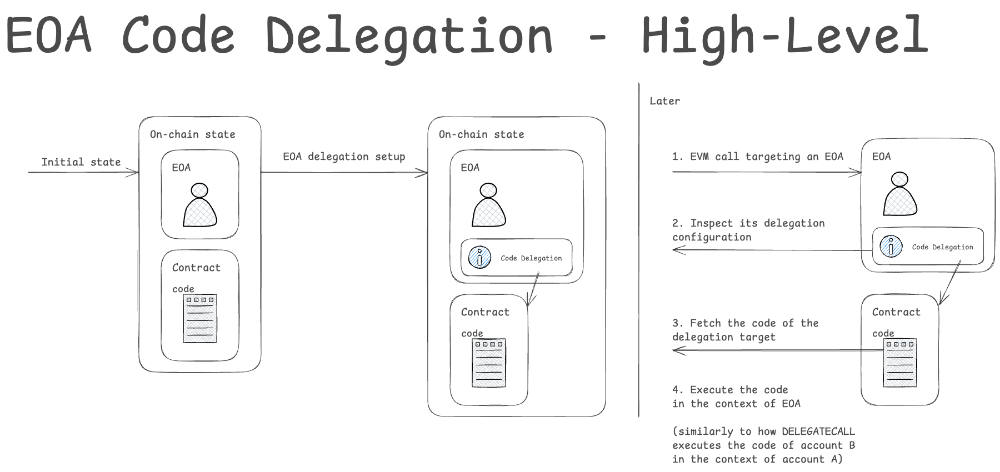
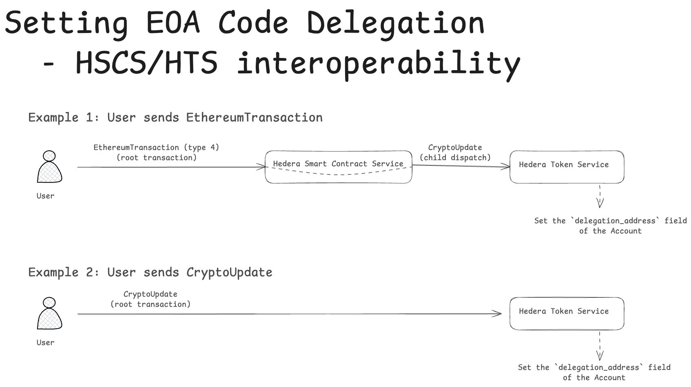
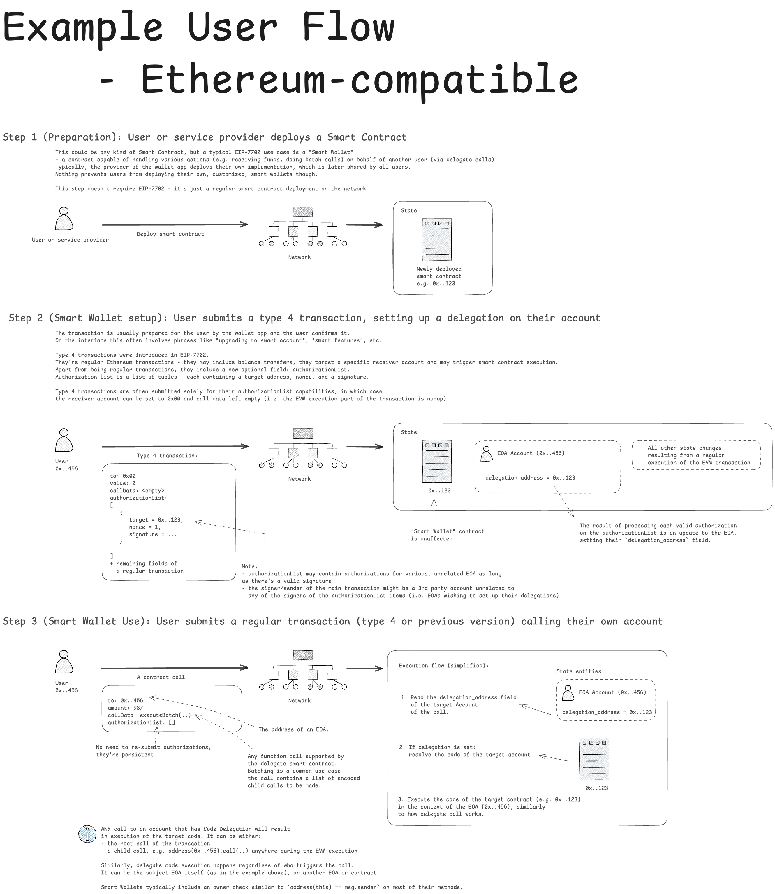
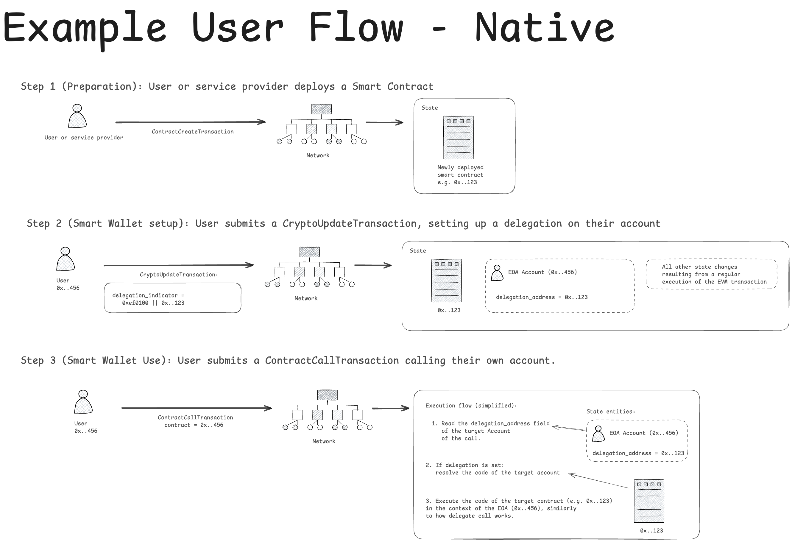
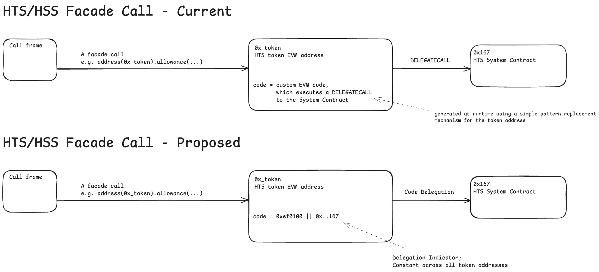
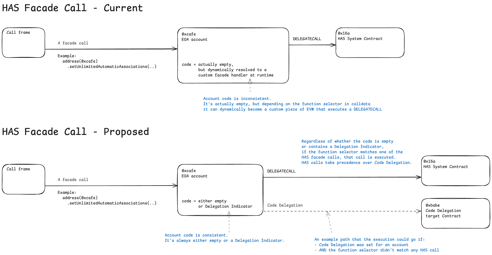

## Abstract

Ethereum's Pectra upgrade (activated May 7, 2025) introduced, among other things, EOA (Externally Owner Account) Code Delegation. It has originally been defined in EIP-7702. This HIP defines the adoption of this feature in Hiero, Hiero-specific modifications and extensions of it, and the related changes to HSCS's proxy/facade mechanism.

## Motivation

EOA Code Delegation is the core of Ethereum's Pectra upgrade and enables a wide range of use cases. Supporting it aligns with the goal of maintaining compatibility with Ethereum Mainnet.

## Rationale

The main proposal of this HIP is to implement EOA Code Delegation closely mimicking the original specification defined in EIP-7702.

All proposed changes are a result of analysis of how Code Delegation can best fit into the existing protocol.

## User Stories

- As a network user, I want to be able to set Code Delegation for an EOA using Ethereum-comptabile wallets and tools, so that EVM calls to my account can result in code execution.
- As a network user, I want to be able to set Code Delegation for an EOA using native `CryptoCreate` or `CryptoUpdate` transactions.
- As a network user, I want to be able to call an EOA and execute a correct delegate Smart Contract code if Code Delegation has been set for that account.
- As a network user, I want to be able to use the existing HTS/HSS/HAS facade calls with no interface changes.

## Specification

EOA Code Delegation has originally been defined in EIP-7702. We propose to adopt it with minimum changes.

### High-Level Summary

The primary feature of EOA Code Delegation is to allow users to configure their EOAs to point to an EVM code stored in another on-chain Smart Contract account.
When such a configuration is set up, any EVM calls targetting that account will result
in execution of the Smart Contract's EVM code in the context of original EOA (similarly to how DELEGATECALL executes the code of Contract B in the context of Contract A).



There are two main aspects of this feature:

1. Being able to configure Code Delegation for an account 
2. Executing the Code Delegation logic when an EVM call is processed

Both have been described in detail in dedicated sections below.

### Configuring Code Delegation For an Account

This section describes how Code Delegation data for the given EOA is stored and what are the means of updating it.

#### Storing The Code Delegation Data

The storage format originally defined in EIP-7702 consists of a Delegation Indicator - a fixed prefix of `0xef0100` followed by 20-byte EVM address of the delegation target.

```
delegation_indicator = 0xef0100 || 20-byte address
```

Delegation Indicators are stored in the `code` field of an Ethereum account, the same field that is used for contract bytecode storage.

We propose an alternative storage mechanism, which should be a better fit for our entity model.

The delegation target address will be stored on the Account entity in a new, optional field. We propose to extend the Account protobuf message in the following way:

```
message Account {
  
  ...

  /**
  * The delegated contract address for the account.
  * If this field is set, a call to the account's address within a smart contract will
  * result in the code of the authorized contract being executed.
  */
  bytes delegation_address = 39;
}
```

For EVM compatibility, Hiero Smart Contract Service will assemble the correct Delegation Indicator (i.e. prefix the `delegation_address` with `0xef0100`) for any bytecode queries of an EOA.

For external observers, for example those using ContractGetBytecode queries, the code of an EOA will no longer be fixed to the account facade proxy code (the impact on the facade proxy mechanism has been described in more detail below). It will be either empty (no delegation) or an EVM-compatible Delegation Indicator.

As a result, all code-related queries previously available for contract accounts should now also function for EOAs, which include:
- `ContractGetBytecodeQuery`
- `eth_getCode` RPC method

Since the code of a regular contract cannot begin with `0xef` (as per EIP-3541), only the code of an EOA can contain a Delegation Indicator.

The delegation target address is an arbitrary 20-byte address. No additional validation is done at the time of storing it (e.g. whether it points to a valid contract, etc), the only exception being `0x0000000000000000000000000000000000000000` - any attempt to store it will result in clearing of the delegation address.

To match the updated Account model, `CryptoGetInfoResponse` will also include an additional field in its `AccountInfo`:

```
message AccountInfo {

  ...

  /**
  * The delegated contract address for the account.
  * If this field is set, a call to the account's address within a smart contract will
  * result in the code of the authorized contract being executed.
  */
  bytes delegation_address = 23;
}
```

#### Updating Code Delegation of an EOA

We propose to enable two ways of setting/updating the Code Delegation. One using Hiero-specific API, and another one using a new EVM transaction type following the specification of EIP-7702.

##### Updating Code Delegation Via CryptoCreate or CryptoUpdate Transaction

We propose to extend `CryptoCreateTransactionBody` and `CryptoUpdateTransactionBody` with an additional field holding a 20-byte EVM address that the user wishes to setup as a delegation target for their account:

```
message CryptoCreateTransactionBody {
...

  /**
  * The delegated contract address for the account.
  * If this field is set, a call to the account's address within a smart contract will
  * result in the code of the authorized contract being executed.
  * The field should be either empty or contain a raw 20-byte EVM address (NOT a `0xef0100`-prefixed delegation indicator).
  * A value of `0x0000000000000000000000000000000000000000` will clear the delegation
  * address on the target account (i.e. set it to an empty byte array).
  */
  bytes delegation_address = 20;
}

message CryptoUpdateTransactionBody {
...

  /**
  * The delegated contract address for the account.
  * If this field is set, a call to the account's address within a smart contract will
  * result in the code of the authorized contract being executed.
  * The field should be either empty or contain a raw 20-byte EVM address (NOT a `0xef0100`-prefixed delegation indicator).
  * A value of `0x0000000000000000000000000000000000000000` will clear the delegation
  * address on the target account (i.e. set it to an empty byte array).
  */
  bytes delegation_address = 21;
}
```

If set, the value of the field will be checked to ensure it's a valid 20-byte EVM address and stored in the Account entity. No other validation will be performed at the time of setting it (e.g. no validation that the target address exists, isn't a precompile, etc).

##### Updating Code Delegation Via a New EVM transaction Type 4, As Defined in EIP-7702

EIP-7702 defines a new EVM transaction type, which extends the previous transaction format with an additional `authorization_list` field:
 ```
    transaction_payload = rlp([chain_id, nonce, max_priority_fee_per_gas, max_fee_per_gas, gas_limit,
                              destination, value, data, access_list, authorization_list, signature_y_parity,
                              signature_r, signature_s])

    authorization_list = [[chain_id, address, nonce, y_parity, r, s], ...]
```

Each entry on the authorization list is an independent intent signifying that the signer of a specific message (consisting of chain_id, address and nonce, defined in detail in EIP-7702) wishes to update their EOA delegation indicator to `address`.
The signer of the message is derived from the components of the signature (`r`, `s`, `y_parity`) and the signed payload using `ecrecover`.
Simplifying, for each item on the list do: `account = ecrecover(r, s, msg); account.setCode(0xef0100 || address)`.

The validity of each item will be checked closely following EIP-7702's specification, which includes (but is not limited to) verifying the correctness of the signature, chain ID and nonce.

If more than one valid authorization entry for the same EOA exists on the list, then only the last one will be used. Any authorizations that come before it will be ignored.

Each successfully processed authorization item will result in a child `CryptoCreate` or `CryptoUpdate` dispatch (depending on whether the affected EOA already exists or not), carrying the intended Code Delegation change. No child dispatch will be created for duplicate authorizations that were skipped.

In addition to the gas cost for each authorization list item (any item valid or not, also including any ignored/skipped entries) defined in EIP-7702 - 12500 or 25000 gas depending on whether the EOA already exists - Hiero will charge its usual hollow account creation cost for any newly created accounts. The maximum number of created hollow accounts is limited by transaction gas limit as well as the ops duration throttle.

Following EIP-7702, all invalid authorization list items will be silently ignored. If, however, an otherwise valid authorization list item cannot be processed because of gas shortage (e.g. if it results in hollow account creation) a child `CryptoCreate` (or `CryptoUpdate`) dispatch should still be created with a failed status to indicate the error to the user.

The authorizations of an EVM type 4 transaction are processed before and independently of the subsequent EVM code execution, which might be a part of the same transaction. Any valid authorizations created while processing the list should be persisted, even if the subsequent EVM code execution fails/reverts.

Following EIP-7702, an EVM type 4 transaction with an empty `authorization_list` is invalid and will be rejected.

#### Updating Code Delegation - HSCS/HTS interoperability

The diagram below illustratest the interoperability between HSCS and HTS for two cases: when the Code Delegation update originates from either EthereumTransaction or CryptoUpdate.



#### Updating EOA's Code Delegation - Summary of Record Stream Changes

- `CryptoCreate` and `CryptoUpdate` transaction bodies will be extended with a new `delegation_address` field
- `Account` entity will be extended with a new `delegation_address` field

### Executing The Code Delegation Logic When an EVM Call Is Processed

The second aspect of EOA Code Delegation is an update to the EVM call processing logic.

When a call is made to an account - either a top-level EVM transaction call (i.e. when `transaction.to == EOA address`) or an inner call (e.g. `address(eoa).call(..)` call in a Smart Contract) - HSCS will:

1. Resolve the target Account of the call
2. Read `delegation_address`
3. If `delegation_address` is non-empty: resolve the contract account that is the target of the delegation and run its EVM code in the context of the original EOA, subject to the limitations described below

Throughout the EVM execution any queries for the code of an account (e.g. when using the `EXTCODECOPY` opcode) will be handled as follows:

1. Resolve the target entity
2. If it's a Contract: use `ContractStateStore` to fetch the bytecode
3. If it's an Account: prefix the `delegation_address` with `0xef0100` to form an EVM-compatible Delegation Indicator and return it as the bytecode. If `delegation_address` is unset, then return an empty bytecode.

One notable difference is that EVM code execution might result in EVM storage updates on the original EOA account as well as emit EVM events.
As a result, all queries related to EVM storage and logs previously available for contract accounts should now also function for EOAs, which include:
- `eth_getStorageAt` RPC method
- `eth_getLogs` RPC method
- all related APIs on the Mirror Node, including `/api/v1/contracts/*` endpoints (like `/api/v1/contracts/call`, `/api/v1/contracts/results/logs`, etc), which should be able to answer to any EOA requests

In essence, all facilities available for contract accounts should also be availalbe for EOAs.

Aside from code execution, the call might still carry a value transfer. The only difference in that regard is that if the code execution reverts, then the associated value transfer should also revert.

The following checks will be applied before executing the EVM code of the target contract:

- targetting a non-existent account results in a no-op code execution
- targetting a precompile address results in a no-op code execution
- targetting a system contract (HTS, HAS, etc) address results in a no-op code execution
- targetting a system account address results in a no-op code execution
- targetting an existing EOA with empty code results in a no-op code execution
- targetting an existing EOA, which itself contains code delegation results in literal execution of the delegation indicator (which will fail since `0xef` is a banned op code)
- targetting an existing contract with non-empty code results in the execution of its EVM code, with the exception of calls matching one of Hiero Account Service proxy methods (described in detail below)

In case Code Delegation points to another delegation, creating a potential chain or loop of delegations, only the first one will be resolved and the code of the target address will be interpreted literally, even if it's a Delegation Indicator.

Users changing delegation targets should be aware of potential storage slot conflicts between different delegate contracts. Delegate contracts are encouraged to use namespaced storage patterns (e.g., ERC-7201) to minimize collision risks.

The updated processing logic applies to the new EVM transaction type (4), any of the previous EVM transaction types,
native `ContractCallTransaction` and native `ContractCreateTransaction`.

### Example User Flows

Below we present two complete example user flow diagrams: one utilizing an EVM type 4 transaction (e.g. when the user uses standard Ethereum-compatible tools) and another one demonstrating the Code Delegation feature using solely Hiero-native operations.

Ethereum-compatible example utilizing an EVM type 4 transaction:



Native example utilizing `CryptoUpdateTransaction` and `ContractCallTransaction`:



### Overview of Protocol Changes

For quick reference, this sections summarizes all proposed changes on a high-level.

State Changes:
- EOAs will store their Code Delegations in a new field on the Account entity
- For external observer: the bytecode of an EOA will be empty or will contain a mutable Delegation Indicator
- EOA's storage slots can be non-empty and become mutable

Transaction Format Changes:
- `CryptoCreate` and `CryptoUpdate` will be extended with a new `delegation_address` field
- `EthereumTransaction` will be extended with a new EVM transaction type 4
- Some outputs of the transaction previously reserved for contracts will also support EOAs (storage slots changes, EVM logs)

Execution Logic Changes:
- HSCS will recognize `delegation_address` of an Account and emulate an EVM-compatible Delegation Indicators
- Code Delegation Indicators will be recognized while processing EVM calls and processed accordingly
- EVM type 4 transaction will be processed as specified
- `CryptoCreate` / `CryptoUpdate` will be updated to handle setting/updating `delegation_address` of an Account

### Impact on Proxy/Facade Calls

HIP-218, followed by HIP-719 (later extended by HIP-755 and HIP-906) introduced the concept of proxy/facade calls, where a call can be made directly to an EVM address of a Hiero-native entity (e.g. an HTS token or an account).
The implementation of this facility currently relies on an intermediate, hardcoded and dynamic piece of EVM code that is being run when such a call is made.
While functional, this has two main downsides:

- It interferes with the implementation of EOA Code Delegation
- It will become an unnecessary complexity once EOA Code Delegation is available

Currently three types of facade calls exist:

- Facade calls to HTS tokens
- Facade calls to HSS schedule objects
- Facade calls to HAS accounts

We propose to update the underlying implementation of the HTS and HSS proxy/facade calls to leverage Code Delegations, by replacing the custom piece of EVM code with a Delegation Indicator targetting a corresponding System Contract.

The comparison of the existing mechanism to the proposed one has been captured on the below diagram:



As a result, queries that return the bytecode of HTS Token Accounts and HSS Schedule Accounts will need to be updated across the whole stack. This includes:

- ContractGetBytecodeQuery
- eth_getCode queries on the JSON RPC Relay
- API queries on the Mirror Node

HAS facade requires more care as it must harmonize with user-defined Code Delegations.
For compatibility reasons, we propose HAS facade calls to have precedence over any user-defined delegations, if the function selector of the call matches one of the HAS facade functions.

Currently the following HAS proxy methods exist:

| Function signature                                             | Function selector |
| -------------------------------------------------------------- | ----------------- |
| hbarAllowance(address spender)                                 |        0xbbee989e |
| hbarApprove(address spender, int256 amount)                    |        0x86aff07c |
| setUnlimitedAutomaticAssociations(bool enableAutoAssociations) |        0xf5677e99 |

The processing logic for calls targetting EOAs will therefore be:

1. If call input data matches one of the HAS selectors: redirect the call to HAS (ignore any Code Delegation, if set)
2. Else if EOA has Code Delegation: resolve the target account and process the delegation
3. Else (no Code Delegation): no-op

Note, that HAS calls might shadow the functions in the delegate contract if there is a selector conflict. E.g. if the user-defined delegate contract included a function of signature `setUnlimitedAutomaticAssociations(bool)`, or any other signature matching a HAS proxy method, they would be unreachable.

The diagram below illustrates the proposed change:



### Hooks Interoperability

No impact on hook execution is expected.

A call to an EOA with Code Delegation set within a hook will work the same way as in non-hook environment.

Hooks have a dedicated storage namespace, so the fact that Code Delegation might change EOA's storage slots does not introduce a conflict.

### Impact on Mirror Node

Mirror Node will be impacted in the following ways:

- `CryptoCreate` / `CryptoUpdate` transaction body parsing in the imported will be updated
- A new field will be added to the `Account` entity
- EOA storage slots will be mutable
- The code (as returned by ContractGetBytecode) of HTS tokens and HSS schedule addresses will be updated to a Delegation Indicator targetting a corresponding System Contract address
- all related APIs on the Mirror Node, including `/api/v1/contracts/*` endpoints (like `/api/v1/contracts/call`, `/api/v1/contracts/results/logs`, etc) should work for both contracts and EOA's

We propose the following changes to the Mirror Node API:

#### Accounts API

##### `GET /api/v1/accounts` endpoint

A new field will be added for each account in the response, called `delegation_address`. If unset, the value will be `0x`.

Response format:

```
{
  "accounts": [
    {
      "account": "0.0.7488058",
      "alias": "LTKD3QWHBYS2FPYGSNYMRWCHBGCQNKWB",
      ...
      "created_timestamp": "1766093540.161994001",
      "decline_reward": false,
      "delegation_address": "0x019b8ee526333d9cbbbc35fff0309794dfa73451",
      "deleted": false,
      ...
    },
    ...
  ],
  "links": {
    "next": null
  }
}
```

##### `GET /api/v1/accounts/{idOrAliasOrEvmAddress}` endpoint

A new field will be added for the account, called `delegation_address`. If unset, the value will be `0x`.

Response format:

```
{
  "account": "0.0.2",
  "alias": null,
  ...
  "created_timestamp": "1706812520.644859498",
  "decline_reward": false,
  "delegation_address": "0x019b8ee526333d9cbbbc35fff0309794dfa73451",
  "deleted": false,
  ...
}
```

#### Contracts API

##### `GET /api/v1/contracts/{contractIdOrAddress}/results` endpoint

This endpoint will include results for EOAs as well. An additional field called `authorization_list` will be included.

Response format:

```
{
  "results": [
    {
      "address": "0x4af07974dae3cb2daf46fb80e8544d45138ee54f",
      "amount": 0,
      "authorization_list": [
        {
          "chain_id": "0x01",
          "address": "0x1111111111111111111111111111111111111111",
          "nonce": 5,
          "y_parity": 1,
          "r": "0x2222222222222222222222222222222222222222222222222222222222222222",
          "s": "0x3333333333333333333333333333333333333333333333333333333333333333"
        },
        ...
      ],
      ...
      "to": "0x00000000000000000000000000000000007242d6",
      "hash": "0xe449dc260ecc1b8bf8e45bbbc14211f7e2fbc9de6b53e62d873e8b2cb95c13eb"
    },
   ...
   ],
   "links": {
    "next": null
  }
}
```

##### `GET /api/v1/contracts/{contractIdOrAddress}/results/{timestamp}` endpoint

This endpoint will include results for EOAs as well. An additional field called `authorization_list` will be included.

Response format:

```
{
  "address": "0x4af07974dae3cb2daf46fb80e8544d45138ee54f",
  "amount": 0,
  "authorization_list": [
    {
      "chain_id": "0x01",
      "address": "0x1111111111111111111111111111111111111111",
      "nonce": 5,
      "y_parity": 1,
      "r": "0x2222222222222222222222222222222222222222222222222222222222222222",
      "s": "0x3333333333333333333333333333333333333333333333333333333333333333"
    },
    ...
  ],
  ...
  "contract_id": "0.0.7488214",
  ...
}
```

##### `GET /api/v1/contracts/results` endpoint

This endpoint will include results for EOAs as well. An additional field called `authorization_list` will be included.

Response format:

```
{
  "results": [
    {
      "address": "0x00000000000000000000000000000000000004e5",
      "amount": 0,
      "authorization_list": [
        {
          "chain_id": "0x01",
          "address": "0x1111111111111111111111111111111111111111",
          "nonce": 5,
          "y_parity": 1,
          "r": "0x2222222222222222222222222222222222222222222222222222222222222222",
          "s": "0x3333333333333333333333333333333333333333333333333333333333333333"
        },
        ...
      ],
      ...
      "contract_id": "0.0.1253",
      ...
    },
    ...
  ],
  "links": {
    "next": null    
  }
}
```

##### `GET /api/v1/contracts/results/{transactionIdOrHash}` endpoint

This endpoint will include results for EOAs as well. An additional field called `authorization_list` will be included.

Response format:

```
{
  "address": "0x4af07974dae3cb2daf46fb80e8544d45138ee54f",
  "amount": 0,
  "authorization_list": [
    {
      "chain_id": "0x01",
      "address": "0x1111111111111111111111111111111111111111",
      "nonce": 5,
      "y_parity": 1,
      "r": "0x2222222222222222222222222222222222222222222222222222222222222222",
      "s": "0x3333333333333333333333333333333333333333333333333333333333333333"
    },
    ...
  ],
  ...
  "contract_id": "0.0.7488214",
  "created_contract_ids": [],
  ...
}
```

##### Remaining endpoints

The following endpoints will contain results for EOAs as well. No change in the response format will be made.

- `GET /api/v1/contracts/{contractIdOrAddress}/results/logs`
- `GET /api/v1/contracts/{contractIdOrAddress}/state`
- `GET /api/v1/contracts/results/{transactionIdOrHash}/actions`
- `GET /api/v1/contracts/results/{transactionIdOrHash}/opcodes`
- `GET /api/v1/contracts/results/logs`

### Impact on RPC Relay

- RPC Relay will need to support EVM type 4 transactions
- RPC Relay will need to update its internal logic for account entity types/hardcoded bytecode of HTS and HSS tokens
- `eth_getStorageAt`, `eth_getCode`, `eth_getLogs` and all other contract-related requests should work for EOAs

### Impact on SDK

All supported SDKs will need to support submitting `EthereumTransaction`s containing the payload of a type 4 transaction.
In principle this should work out of the box, but any related code paths that involve parsing the raw Ethereum transaction payload (e.g. for validation reasons) will need to handle the type 4 transactions.

SDKs will also need to support the new field in CryptoCreate / CryptoUpdate transaction bodies.

### Impact on Hashscan

- The explorer should display whether the given EOA is currently using Code Delegation and show its target address.
- The explorer should show the new/modified authorizations that have been set while processing `EthereumTransaction` (V4), `CryptoUpdate` or `CryptoCreate`.

## Backwards Compatibility

The change itself is backwards compatible, but it significantly modifies the behavior of calls to EOAs and invalidates some previous assumptions, for example that the code of an EOA is always empty or that `msg.sender == tx.origin` only happens in the topmost execution frame.

## Security Implications

Code Delegations and the proposed way to implement it align with the overall gist of the V2 security model, but since it's a new feature, we propose to extend the definition of the security model to explicitly mention it.

We propose to rephrase the following sentence:

"Smart contract A can change EOA’s state via delegate call"

to

"Smart contract A can change EOA’s state via delegate call or if EOA has set up a Code Delegation to A."

The security is in the hands of the user - EOA owner - as they are the ones deciding which contract code they wish to delegate the execution to. If any System Contract is called within the delegated contract code, it will have full EOA rights, as it is executed in the context of EOA. This complies to the V2 security model, as it's only the user who can set up the delegation in the first place.

In summary, there are no new threats or risks for Hiero networks, aside the inherent risks of the EIP-7702 Code Delegation adoption within the Ethereum Ecosystem.
There is a considerable amount of educational materials (articles, blog posts) in the Ethereum community that explain the inherent risks of EIP-7702 and establish best practices for using this feature.

Code Delegation directly to System Contracts will be forbidden for regular EOA accounts (no-op, as described in the appropriate section above) and will only be permited for the following native entities: Token Proxy Account, Schedule Proxy Account to facilitate the proxy/facade mechanism described earlier.

## How to Teach This

Hiero will support EIP-7702-like EOA Code Delegation, with the following modifications:
- Hiero's account creation cost will be charged when setting Code Delegation for new accounts
- Users can use either Ethereum-compatible tools or Hiero native transactions to modify their Code Delegations
- Delegations to functions matching the signatures of HAS will not work (HAS calls have precedence)
- HTS/HSS proxy/facade calls remain unchanged from user’s perspective

## Reference Implementation

The reference implementation must be complete before any HIP is given the status
of “Final.” The final implementation must include test code and documentation.

## Rejected Ideas

None at this time.

## Open Issues

## References

https://eips.ethereum.org/EIPS/eip-2718

https://eips.ethereum.org/EIPS/eip-7702

https://eips.ethereum.org/EIPS/eip-3541

https://hips.hedera.com/hip/hip-218

https://hips.hedera.com/hip/hip-719

https://hips.hedera.com/hip/hip-755

https://hips.hedera.com/hip/hip-906

https://docs.hedera.com/hedera/core-concepts/smart-contracts/security

## Copyright/license
This document is licensed under the Apache License, Version 2.0 —
see [LICENSE](../LICENSE) or <https://www.apache.org/licenses/LICENSE-2.0>.
